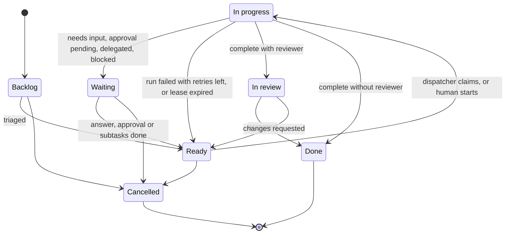
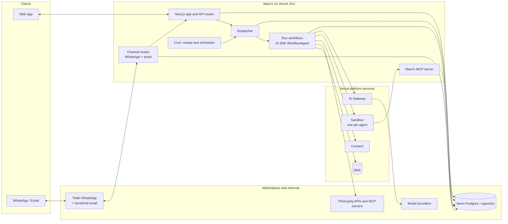

# Mach1: Product Specification

| | |
|---|---|
| **Status** | Draft v0.5. Launch channels: WhatsApp (Twilio) and email |
| **Date** | 2026-10-07 (v0.5) |
| **Owner** | TBD |

> Everything here is a proposal to react to. Items marked **[Decision Dn]** need a call before we build; they are collected in [§14 Open questions](#14-open-questions-and-decisions).

## Contents

1. [Summary](#1-summary)
2. [Problem and opportunity](#2-problem-and-opportunity)
3. [Goals, non-goals, assumptions](#3-goals-non-goals-assumptions)
4. [Product principles](#4-product-principles)
5. [Users and roles](#5-users-and-roles)
6. [Core concepts](#6-core-concepts)
7. [Feature specifications](#7-feature-specifications)
   - [F1 Company Profile](#f1-company-profile)
   - [F2 Company Brain](#f2-company-brain-memory)
   - [F3 Agents: Chief of Staff and workers](#f3-agents)
   - [F4 Task board and dispatcher](#f4-task-board-and-dispatcher)
   - [F5 Agent capabilities: MCP, skills, sandbox](#f5-agent-capabilities)
   - [F6 Communication channels](#f6-communication-channels)
   - [F7 Collaboration](#f7-collaboration)
   - [F8 Permissions, approvals, safety](#f8-permissions-approvals-safety)
   - [F9 Observability](#f9-observability)
   - [F10 Workspace setup and admin](#f10-workspace-setup-and-administration)
8. [Key user journeys](#8-key-user-journeys)
9. [Architecture](#9-architecture)
10. [Non-functional requirements](#10-non-functional-requirements)
11. [Roadmap](#11-roadmap)
12. [Success metrics](#12-success-metrics)
13. [Risks](#13-risks)
14. [Open questions and decisions](#14-open-questions-and-decisions)
- [Appendix A: What we borrow from personal agents](#appendix-a-what-we-borrow-from-personal-agents)

---

## 1. Summary

Mach1 is a command center for running a small or medium-sized business. In one workspace, **people work with people, people work with AI agents, and agents work with each other** to get the company's work done.

Every company on Mach1 gets:

- a **Company Profile** describing who the company is, who does what and who reports to whom,
- a **Company Brain** where agents store what they learn,
- a **Chief of Staff**, the coordinator agent that runs the agent team,
- **worker agents** the company creates for specific jobs (coder, data entry, bookkeeper…),
- a **Kanban board** where tasks go to humans or agents, and a **dispatcher** that starts agents automatically when their work is ready,
- **channels** (WhatsApp, email, in-app), ticked per agent, so people can talk to agents from wherever they already work.

Agents should be as capable as open-source personal agents like OpenClaw and Hermes Agent: tools over MCP, skills, a sandboxed cloud computer (Vercel Sandbox), memory, schedules, messaging. The difference is that Mach1 agents work for a company rather than for one person.

## 2. Problem and opportunity

- **SMEs run on a patchwork** of email, WhatsApp groups, spreadsheets, a task tool and a handful of SaaS apps. Much of what the business knows sits in the founder's head.
- **Today's capable agents are personal.** OpenClaw and Hermes Agent each serve one user on one machine with one memory. They don't know the org chart, can't share work with colleagues, and don't hand off to other agents.
- **"AI features" in business tools are chatbots bolted onto existing products.** In those tools the agent is a feature, not a teammate who owns work.

**Mach1's bet:** an SME gets more done when agents are members of the company. Each agent has a job description, a manager, a task queue and a way to reach it. It can read shared company knowledge, and the whole team, human and agent, works from the same board.

## 3. Goals, non-goals, assumptions

### Goals (v1)

1. A founder goes from sign-up to a Chief of Staff that knows the company **in one conversation (< 30 min)**.
2. Any member can **create a worker agent** from a template or by describing the job, without writing code.
3. A task assigned to an agent **starts automatically**, runs in a sandbox, and ends with either a reviewable result or a clear question for a human.
4. **Agents learn.** Corrections and discoveries go into the Company Brain and change what agents do next time.
5. Members **reach agents on the channels they already use**.
6. **Owners stay in control** through approvals for risky actions, spend limits and a full audit trail.

### Non-goals (v1)

- Structured HR/ERP data (payroll, contracts, headcount planning). The profile is text.
- Building our own sandbox, durable-execution engine, model gateway or credential store. We use Vercel's.
- Portability layers. We accept lock-in to Vercel in exchange for shipping sooner (see [Build strategy](#build-strategy)).
- Replacing Slack/Teams as the company's general chat. Human↔human collaboration in v1 centers on tasks and shared threads.
- Customer-facing agents, i.e. agents talking to the company's own customers or suppliers. Likely v2 ([D8](#14-open-questions-and-decisions)).
- Native mobile apps. In v1 the channels are the mobile experience, and the web app is responsive.
- Self-hosted / on-prem deployment.

### Assumptions from the brief

- **"Coordinator" and "Chief of Staff" are the same agent:** one per workspace, created automatically.
- **"MCP and skills" support** means: tools via the Model Context Protocol, plus packaged procedures in the open Agent Skills (`SKILL.md`) format used by OpenClaw and Hermes Agent.
- **Speed to market beats technical elegance.** Where Vercel has a solution we use it, even if a specialist tool would be better; where it doesn't, we build the simplest thing ourselves. See [Build strategy](#build-strategy).
- **Built in TypeScript on Vercel**: AI SDK, AI Gateway, Workflow, Sandbox, Chat SDK, Connect, Blob, Cron, plus Neon Postgres from the Marketplace and WorkOS AuthKit for sign-in, orgs and invitations.
- **Company knowledge is free text**, not hard data. We add structure only where the platform can't function without it.

## 4. Product principles

1. **Humans and agents are both Members.** They share the same primitives: profile, role, manager, inbox, channels, task assignments, permissions. Anything you can do with a human teammate (assign, mention, message, review), you can do with an agent.
2. **Text over schema.** Company knowledge is prose that humans and agents both read and edit.
3. **The board is the source of truth for work.** Agents delegate to each other through tasks, not hidden side channels, so all work is visible, attributable and resumable.
4. **Everything is observable.** We log every run, tool call, message, memory write and approval, and let people inspect them.
5. **Safe by default, autonomous by choice.** New agents start conservative. Owners raise autonomy per agent and per action.
6. **Buy or borrow before we build.** Platform (Vercel's agent stack), sandbox (Vercel Sandbox), memory (Postgres + pgvector), tools (MCP), skills (open format), channels (official APIs). Our value is the orchestration and the experience.
7. **Platform as MCP.** Mach1's own capabilities (tasks, messaging, brain, profile) reach agents through an MCP server. That keeps the agent runtime swappable and leaves room for third-party agents to join a workspace later.

## 5. Users and roles

| Persona | Description | Typical needs |
|---|---|---|
| **Owner / founder** | Creates the workspace; ultimately accountable | Build the profile, create agents, approve risky actions, see what's happening |
| **Manager** | Runs a team or function | Assign work to humans and agents, review outputs |
| **Team member** | Does the work | Pick up tasks, ask agents for help from their phone, hand off grunt work |
| **Chief of Staff** (agent) | One per workspace, created automatically | Keep the profile current, triage requests, plan and delegate, chase progress, report |
| **Worker agent** | Created by members | Do a specific job: coding, data entry, bookkeeping, research, drafting… |

Human workspace roles are **Owner, Admin, Member, Guest** ([F8](#f8-permissions-approvals-safety)). Agents get permissions per agent rather than from these roles.

## 6. Core concepts

| Concept | Definition |
|---|---|
| **Workspace** | One company (tenant). All data is scoped to a workspace. |
| **Member** | A human or an agent in a workspace. Members can be assigned work, mentioned and messaged. |
| **Chief of Staff (CoS)** | The workspace's coordinator agent. Exactly one per workspace. It can't be deleted but can be renamed. |
| **Worker agent** | Any other agent, defined by its job description, instructions, tools, skills, channels and limits. |
| **Company Profile** | Curated, human-approved text describing the company. Loaded into every agent's context. |
| **Company Brain** | Memories agents accumulate about the company, its people, customers and procedures. Retrieved when relevant. |
| **Task** | A unit of work on the board with one assignee, human or agent. Can have subtasks and dependencies. |
| **Dispatcher** | The service that detects agent tasks ready to start and starts runs for them. |
| **Run** | One execution of an agent, triggered by a task, message, schedule, approval or another agent. Each run has a transcript, a cost and an outcome. |
| **Sandbox** | An isolated cloud computer (a Vercel Sandbox microVM) where an agent runs code, uses a browser and works with files. |
| **Integration / tool** | A capability exposed over MCP (Gmail, Xero, GitHub, HubSpot…) or built in. |
| **Skill** | A packaged procedure (`SKILL.md` plus optional scripts) that teaches an agent to do a specific job. |
| **Channel** | A way to reach a member: in-app, email, WhatsApp. |
| **Thread** | A conversation between members, in any mix of humans and agents, on any channel. |
| **Approval** | A request from an agent asking a human to allow an action before it happens. |

---

## 7. Feature specifications

Priorities: **P0** = MVP · **P1** = fast follow · **P2** = later.

### F1. Company Profile

**Purpose.** A living description of the company. Every agent reads it before doing anything, and new humans can read it to onboard.

**Shape.** A small set of markdown sections, not a database. Suggested defaults, which members can edit, add to or remove:

| Section | Contents |
|---|---|
| Overview | What we do, for whom, where; size and stage |
| Mission, Vision, Values | In the company's own words |
| Goals | Current objectives and priorities for this quarter |
| People & Responsibilities | Who's who, who reports to whom, who owns what, how to reach them |
| Agents | The agent team and what each agent does (maintained automatically) |
| Products & Services | What we sell and how |
| Customers & Market | Who buys, key accounts, competitors |
| How We Work | Policies, tone of voice, approval norms, working hours, tools we use |
| Glossary | Internal terms, acronyms, codenames |

| ID | Pri | Requirement |
|---|---|---|
| PROF-1 | P0 | **Onboarding interview.** When a workspace is created, the CoS interviews the owner (in-app or on a channel) and drafts the profile. It keeps asking follow-up questions until each core section has content or the owner explicitly skips it. |
| PROF-2 | P0 | **Updates by chat.** Any member can tell the CoS a change ("Sam now runs sales and Priya reports to Sam"), and the CoS proposes the edit. |
| PROF-3 | P0 | **Direct editing** in a markdown/rich-text editor. |
| PROF-4 | P1 | **Versioning.** Every change records the author (human or agent), timestamp, diff and reason. Any version can be restored. |
| PROF-5 | P0 | **Change control.** By default, agent-proposed edits need owner/admin approval. A toggle lets the CoS edit without approval. |
| PROF-6 | P0 | **Context injection.** Every agent run includes the profile, compressed if it exceeds a token budget. Sections can be marked *load on demand* to keep the always-loaded part small. |
| PROF-7 | P1 | **Org chart view**, rendered from the People section. Read-only; the text stays the source of truth. |
| PROF-8 | P1 | **Staleness nudges.** The CoS asks owners to confirm sections that haven't changed in N months or that conflict with recent Brain memories. |
| PROF-9 | P2 | **Import** a starting profile from a website URL, pitch deck, existing documents or a company LinkedIn page. |

> **Members vs. profile.** Member records (human/agent, login, channels) are structured because assignment, auth and messaging depend on them. Titles, responsibilities and reporting lines live in profile text. **[Decision D2]** Should each member also get one optional `manager` link, used only to route approvals and escalations? *Recommendation: yes.* The org would still be described in prose.

### F2. Company Brain (memory)

**Purpose.** Where agents store what they learn on the job, so the company gets smarter over time.

| | Company Profile | Company Brain |
|---|---|---|
| Written by | Humans (agents propose) | Agents (humans curate) |
| Content | Canonical, curated narrative | Many small facts, preferences and procedures |
| Loaded | Always, in context | Retrieved when relevant |
| Example | "We sell refurbished farm equipment across the UK." | "Acme's invoices arrive as PDFs from billing@acme.example, with the VAT number on page 2." |

**Memory types:**
- *Facts* about the company, customers, suppliers and systems
- *Preferences* of people, e.g. "The founder wants summaries as bullet points"
- *Procedures*, e.g. "To issue a refund: …". These graduate into skills ([F5.3](#f53-skills)).
- *Episodes*: what happened on a task, its outcome, lessons learned

**Scopes:**
- *Workspace*: shared by all agents
- *Agent*: private to one agent
- *Person*: about or for a specific human
- *Project/task* (P1)

| ID | Pri | Requirement |
|---|---|---|
| BRAIN-1 | P0 | Agents have tools to `remember`, `recall` (semantic + keyword), `update` and `forget` memories. |
| BRAIN-2 | P0 | **Automatic extraction.** After each run and conversation, a background step pulls out candidate memories (corrections, new facts, preferences) and stores them with provenance: run, message, author. |
| BRAIN-3 | P0 | Relevant memories are injected when a run starts (based on the task or message), and agents can search for more during the run. |
| BRAIN-4 | P0 | **Brain UI.** Browse, search, filter by scope/type/agent, edit, delete, pin, and see provenance ("learned from task #142 on 3 Oct"). |
| BRAIN-5 | P1 | **Dedup and conflicts.** A memory that contradicts an existing one supersedes it, and the history is kept. Facts carry valid-from/valid-to dates where possible. |
| BRAIN-6 | P1 | **Restricted memories** visible only to named agents/humans. PII redaction rules. |
| BRAIN-7 | P1 | **Brain → Profile promotion.** The CoS suggests moving stable, frequently used memories into the profile. |
| BRAIN-8 | P1 | **Session search.** Full-text search across past conversations and run transcripts, for Hermes-style cross-session recall. |
| BRAIN-9 | P2 | **Knowledge sources.** Index uploaded documents and connected drives (Google Drive, SharePoint) as read-only knowledge alongside memories. |

**Implementation.** Vercel has no memory product, so we build our own. It is deliberately simple:

- **Recommended for v1: a thin TypeScript memory service on our own Postgres + pgvector** (Neon via the Vercel Marketplace).
  - Extraction, dedup and conflict resolution are AI SDK structured-output calls, run as Workflow steps after each run.
  - Embeddings come through AI Gateway.
  - Search is hybrid: pgvector similarity plus Postgres full-text, filtered by scope.
  - No extra service to host, and memories live next to the rest of the workspace data (row-level security, backups, export).
- If recall quality turns out to be a problem after launch, look at Mem0's TypeScript SDK. No spike before launch.

### F3. Agents

#### F3.1 Chief of Staff (coordinator)

Every workspace starts with one. It is the default entry point: *if you don't know who to ask, ask the Chief of Staff.*

Responsibilities:
- **Profile keeper.** Runs the onboarding interview and keeps the profile current ([F1](#f1-company-profile)).
- **Triage.** Takes requests from any channel and either answers directly, creates tasks, or routes them to the right human or agent.
- **Plan and delegate.** Breaks goals into tasks and subtasks, assigns them and sets dependencies.
- **Follow up.** Chases overdue or blocked work, nudges humans, escalates to managers.
- **Report.** Sends owners a daily or weekly brief: what got done, what's stuck, what needs a decision, what it cost.
- **Staffing.** Notices capability gaps ("invoice tasks keep arriving with no owner") and proposes new worker agents for approval.
- **Brain hygiene.** Resolves memory conflicts and promotes stable facts into the profile.

| ID | Pri | Requirement |
|---|---|---|
| COS-1 | P0 | Created automatically with sensible defaults. Can't be deleted; can be renamed, given a new avatar and reconfigured. |
| COS-2 | P0 | Platform tools to read the whole board, create/assign/update any task, message any member and create **draft** agents. |
| COS-3 | P0 | Scheduled daily brief to owners on their preferred channel. Time and days are configurable. |
| COS-4 | P1 | **Board watcher.** A periodic sweep for stale, overdue, blocked or unassigned tasks; the CoS acts or escalates. |
| COS-5 | P1 | **Triage-only mode.** The CoS never executes work itself and only routes it. |

#### F3.2 Worker agents

There are two kinds:
- **Defined agents** have a standing profile and do similar work again and again (sales outbound, financial analysis, bookkeeping).
- **Worker agents** are made for one task, with a role (e.g. "Financial analysis"), and archived when the task closes. Anyone (or the Chief of Staff) can add one to a task.

Each defined agent is configured on an Agent Settings page. Every field is editable, and each change creates a new version:

| Field | Notes |
|---|---|
| Name, avatar | Shown wherever members appear |
| Role / title | e.g. "Bookkeeper" |
| Job description | Plain language: what it's responsible for and what good looks like. Also the core of its system prompt. |
| Instructions | Detailed guidance, do's and don'ts |
| Manager | The human (or the CoS) who gets its escalations and approval requests |
| Model | Workspace default, overridable per agent ([§9.3](#93-models)) |
| Tools & integrations | MCP servers and tools it may use, each with a policy: allow / ask / deny |
| Skills | Attached from the workspace skill library |
| Sandbox template | Base, Coder (git, Node, Python), Browser (headless Chromium), Data (Python, pandas)… |
| Channels | Tick boxes: In-app (always on), Email, WhatsApp ([F6](#f6-communication-channels)) |
| Brain access | Which memory scopes it can read and write |
| Schedules | Recurring jobs, e.g. "every weekday at 08:00, check the orders inbox" |
| Autonomy level | Preset approval policies: Supervised / Standard / Autonomous ([F8](#f8-permissions-approvals-safety)) |
| Limits | Max concurrent runs, max run duration, spend per run/day/month |
| Status | Draft → Active → Paused → Archived |

| ID | Pri | Requirement |
|---|---|---|
| AGT-1 | P0 | **Create from a template.** Built-in templates: Coder, Data Entry, Researcher, Bookkeeper, Support Drafter, Content Writer, Sales Assistant, Ops Assistant. A template is a pre-filled definition plus recommended tools, skills and sandbox. |
| AGT-2 | P0 | **Create by conversation.** A member says "I need someone to chase unpaid invoices"; the CoS drafts a full definition; a human reviews it and activates it. |
| AGT-3 | P0 | **Create from scratch** with the settings form. |
| AGT-4 | P0 | **Agent page** showing live activity, assigned tasks, recent runs, threads, memories, spend and config history. |
| AGT-5 | P0 | **Pause/resume.** A paused agent gets no dispatched work. Inbound messages get an auto-reply and go to its manager. |
| AGT-6 | P1 | **Test drive.** Run a draft agent on a sample task in dry-run mode: no external side effects, approvals auto-denied. |
| AGT-7 | P1 | **Clone**, and export/import an agent definition as a file (agent-as-code). |
| AGT-8 | P2 | Template marketplace shared across workspaces. |

#### F3.3 Lifecycle

- A config change creates a new agent version. Runs already in progress keep the version they started with; the next run uses the new one.
- Archiving an agent reassigns its open tasks to its manager (or the CoS) and turns off its channels.

### F4. Task board and dispatcher

#### F4.1 Board

**Canonical statuses.** Teams can rename columns or add new ones, but every column maps to one canonical status so the dispatcher knows what it means:

| Canonical status | Meaning |
|---|---|
| **Backlog** | Captured, not ready to start |
| **Ready** | Ready to work on. If the assignee is an agent, the dispatcher starts it. |
| **In progress** | A human is working on it, or an agent run is active |
| **Waiting** | Blocked on a human answer, an approval, a dependency or subtasks |
| **In review** | Work done, waiting for the reviewer to accept it |
| **Done** | Accepted / complete |
| **Cancelled** | Won't do |



| ID | Pri | Requirement |
|---|---|---|
| BRD-1 | P0 | One default company board. P1: several boards (per team or project) and saved views (by assignee, label, human vs. agent). |
| BRD-2 | P0 | Columns map to canonical statuses (above). |
| BRD-3 | P0 | **Task fields:** title; description (markdown); members (any mix of people and agents; every agent on a task sees all of it: description, summary, thread, files and members); creator; reviewer (optional, defaults to the creator for agent-assigned tasks); status; priority; due date; start-after date; labels; parent; blocked-by dependencies; acceptance criteria; attachments; comments and activity; outputs (files, links, summaries); linked runs; cost so far. |
| BRD-4 | P0 | **Subtasks** are tasks with a parent. The data model allows any depth; the task drawer shows them as a nested list, and parents show rolled-up progress. By default (configurable), a parent can't be Done while it has open subtasks. |
| BRD-5 | P0 | **Dependencies.** A task becomes dispatchable only when every blocked-by task is Done. |
| BRD-6 | P0 | **Ways to create tasks:** the board UI; chat with any agent ("make a task for…"); email or WhatsApp to the CoS; agents themselves (delegation). |
| BRD-7 | P0 | **Comments and @mentions** from humans and agents. Mentioning a member notifies them; mentioning an agent also wakes it ([DSP-2](#f42-dispatcher)). |
| BRD-8 | P0 | **Live updates.** Agent-assigned cards show run progress. MVP: the board polls every few seconds; the open run streams live from its Workflow. |
| BRD-9 | P1 | **Recurring tasks** (cron-like), e.g. "Every Monday: prepare the weekly sales report". |
| BRD-10 | P1 | Task templates and checklists. |
| BRD-11 | P2 | List, calendar and timeline views. |
| BRD-12 | P0 | **Inbox.** Each person's home screen lists the tasks waiting on them (an agent asked, finished work to review, or no agent is on it), urgent first. Each row is two lines: the title and one sentence saying what happened and what's needed. Agents end a run with up to three options, one recommended, picked with a key; replying or picking sends the task back to the agent. Rows can be put off until later. |
| BRD-13 | P0 | **Keyboard first.** J/K move, Enter opens, E approves the recommendation or marks done, 1–3 pick an option, R reply, L later, Z undo, N new task, S summary, / search, ⌘K command palette. |

#### F4.2 Dispatcher

A task is **dispatchable** when all of these hold:

1. Its status is **Ready**.
2. Its assignee is an **Active agent**.
3. Every blocked-by dependency is **Done**.
4. Its `start_after` is empty or in the past.
5. No active run already holds it.
6. The agent is under its concurrency limit, and both the agent and the workspace are under budget.

For a dispatchable task, the dispatcher **claims it atomically** (a lease), sets it to In progress, creates a Run and starts the agent. The agent starts with:
- the company profile,
- the task, with its parent chain, sibling summaries, comments and attachments,
- relevant Brain memories,
- its tools and skills.

**Triggers.** Every code path that changes a task calls the dispatcher directly, which starts a Workflow for each newly dispatchable task. It is event-driven: it reacts when a task is created, updated or assigned, a dependency completes, an approval is resolved, a comment or mention is added, an agent is un-paused, or a budget resets. A Vercel Cron Job sweep (every minute) catches anything the events miss.

**Run outcomes.** An agent ends its run by calling exactly one outcome tool:

| Outcome | Task moves to | Side effects |
|---|---|---|
| `complete(summary, outputs)` | In review if a reviewer is set, otherwise Done | Outputs attached, summary comment posted, reviewer notified |
| `needs_input(question, ask?)` | Waiting | Question goes to the requester or manager on their channel; their reply wakes the agent |
| `delegated(subtasks)` | Waiting | Agent resumes automatically when every subtask finishes |
| `blocked(reason)` | Waiting | Manager notified |
| *(error or timeout)* | Ready with backoff retry (max 3), then Waiting | Error recorded; manager notified after the final failure |

| ID | Pri | Requirement |
|---|---|---|
| DSP-1 | P0 | **At-least-once dispatch with exactly one active run per task.** The claim is a database lease (below). Each run is a durable Vercel Workflow, so a crashed function resumes from its last completed step rather than starting over. The lease is renewed as steps complete; if it expires with no live workflow, the task returns to Ready and the run is marked lost. |
| DSP-2 | P0 | **Wake-ups.** A new comment or mention, a human reply to `needs_input`, an approval decision, or subtask completion resumes the agent with the new input. Short waits (an approval expected within minutes) suspend the same workflow on a Workflow hook, using no compute while waiting. Long waits end the run in Waiting, and the reply starts a new run with earlier context summarized. |
| DSP-3 | P0 | **Review loop.** If the reviewer requests changes, the task returns to Ready with the review comments and the agent runs again. |
| DSP-4 | P0 | **Limits.** Per-run max duration and spend; per-agent and per-workspace concurrency. |
| DSP-5 | P0 | **Human assignees** aren't "run". The dispatcher notifies them of assignments and due dates on their preferred channel. |
| DSP-6 | P1 | **Priority and fairness.** The ready queue is ordered by priority, due date and age, with fair share across agents. |
| DSP-7 | P1 | **Loop protection.** Max delegation depth (e.g. 5), a max number of subtasks per run, and detection of agents bouncing work back and forth. Violations escalate to the CoS or a manager. |
| DSP-8 | P1 | **Manual controls:** *Run now*, *Stop run*, *Retry*, *Take over* (reassign to me with the transcript). |

Claim sketch. A single statement, safe under concurrency; budget and concurrency checks happen just before it:

```sql
UPDATE task
SET status = 'in_progress',
    lease_run_id = :run_id,
    lease_expires_at = now() + interval '5 minutes'
WHERE id = (
  SELECT t.id
  FROM task t
  JOIN agent a ON a.member_id = t.assignee_member_id
  WHERE t.workspace_id = :workspace_id
    AND t.status = 'ready'
    AND a.status = 'active'
    AND (t.start_after IS NULL OR t.start_after <= now())
    AND NOT EXISTS (
      SELECT 1
      FROM task_dependency d
      JOIN task b ON b.id = d.blocked_by_task_id
      WHERE d.task_id = t.id AND b.status <> 'done'
    )
  ORDER BY t.priority DESC, t.due_at NULLS LAST, t.created_at
  LIMIT 1
  FOR UPDATE SKIP LOCKED
)
RETURNING id;
```

### F5. Agent capabilities

**The bar:** anything a well-configured OpenClaw or Hermes agent can do for one person, a Mach1 agent can do for a company.

| Capability | Mach1 | Pri |
|---|---|---|
| Tools via MCP | Workspace MCP registry with per-agent grants | P0 |
| Skills | Workspace library in the open `SKILL.md` format; importable; agents can propose new ones | P0 / P1 |
| Sandbox computer | A Vercel Sandbox per agent | P0 |
| Web search and fetch | Built in | P0 |
| Browser automation | Headless browser in the sandbox | P0 |
| Visual computer use | Desktop sandbox | P2 |
| Memory | Company Brain ([F2](#f2-company-brain-memory)) | P0 |
| Schedules / heartbeats | Agent schedules | P1 |
| Subagents | Short-lived parallel helpers within a run | P1 |
| Messaging channels | [F6](#f6-communication-channels) | P0 / P1 |
| Voice notes | Inbound transcription | P1 |
| Self-improvement | Post-run reflection writes memories and proposes skills | P1 |

#### F5.1 Built-in platform tools ("Mach1 MCP")

Written once as TypeScript functions and filtered by the agent's permissions. Agents on the default runtime call them in-process; harness agents running inside a sandbox ([§9.2](#92-agent-runtime), option B) and future third-party agents reach the same functions through the Mach1 MCP server:

- **Tasks:** list/search, get, create (including subtasks), update, comment, assign, plus the outcome tools (`complete`, `needs_input`, `delegated`, `blocked`)
- **People and agents:** list members, get a member's profile, look up who owns what
- **Messaging:** message a member or thread, ask a human a blocking question, request approval
- **Brain:** remember, recall, update, forget
- **Profile:** read, propose an edit
- **Files:** read and write workspace files and task attachments
- **Schedules** (P1): create, list and cancel its own schedules
- **Agents** (CoS by default): draft an agent, list agents

#### F5.2 MCP integrations

| ID | Pri | Requirement |
|---|---|---|
| MCP-1 | P0 | **Workspace MCP registry.** Admins add remote MCP servers (Streamable HTTP) by URL. Agents connect through the AI SDK MCP client. OAuth flows and tokens are handled by **Vercel Connect** where it has a connector, and by encrypted columns in Postgres otherwise. |
| MCP-2 | P0 | **Curated catalog.** MVP launches with whichever of these Vercel Connect already has a connector for, and adds the rest after launch: Google Workspace, Microsoft 365, Slack, Notion, HubSpot, Xero/QuickBooks, Stripe, Shopify, GitHub, Airtable. Use a maintained MCP server where one exists; otherwise wrap the provider API as our own tools, using a Vercel Connect token. |
| MCP-3 | P0 | **Per-agent grants**, each with a policy: allow / ask / deny. MVP: per integration; per individual tool in P1. |
| MCP-4 | P0 | **Credentials never reach the model or the sandbox.** Tool calls run in our Workflow steps, which fetch short-lived tokens from Vercel Connect at call time and log every call. When code inside a sandbox must call an API, Vercel Sandbox's credential brokering injects the header at the egress proxy, so the secret never enters the VM. |
| MCP-5 | P1 | **Local (stdio) MCP servers** run inside the agent's sandbox from a package spec (npm, pip or container image). |
| MCP-6 | P1 | **Per-person connections.** An agent working for a specific human can use that human's own OAuth connection (e.g. their mailbox) when allowed. Implemented with Vercel Connect user-subject tokens and a one-time consent flow. |
| MCP-7 | P1 | **Large catalogs.** Tool search / deferred loading so dozens of tools don't flood the context window. |

#### F5.3 Skills

| ID | Pri | Requirement |
|---|---|---|
| SKL-1 | P0 | **Open format.** A skill is a folder with `SKILL.md` and optional scripts and resources, in the Agent Skills standard also used by Claude, OpenClaw and Hermes Agent. Community skills therefore work in Mach1. |
| SKL-2 | P0 | **Workspace skill library.** Upload or write skills in an editor, version them, attach them to agents. |
| SKL-3 | P0 | **Progressive disclosure.** Agents see only skill names and descriptions until a skill is relevant; then the full content loads. |
| SKL-4 | P1 | **Import** from public registries (ClawHub, the Hermes Skills Hub, GitHub). Skills can contain scripts, which is a supply-chain risk, so imports are scanned and need admin approval. |
| SKL-5 | P1 | **Agent-authored skills.** After a novel multi-step task, an agent can propose a new skill or an improvement to an existing one. A human approves it before it's published to the library. |

#### F5.4 Sandbox

| ID | Pri | Requirement |
|---|---|---|
| SBX-1 | P0 | **Every agent has a [Vercel Sandbox](https://vercel.com/docs/sandbox)**, a Firecracker microVM, for shell commands, code, file work, a headless browser and local MCP servers. The agent loop itself runs outside the sandbox ([§9.2](#92-agent-runtime)); the sandbox is where its tools execute. |
| SBX-2 | P0 | **Persistence.** Each agent has one persistent sandbox. Vercel saves its filesystem automatically when it stops and restores it on the next run, so installed packages, repos and files survive. Snapshot retention is set to "never expires" for active agents. The sandbox is not the system of record: durable outputs are synced to Vercel Blob. If a restore fails, a fresh sandbox starts from the agent's image. |
| SBX-3 | P1 | **Images** per agent type (MVP: every agent uses the default `universal` image and installs what it needs; the install survives in its persistent sandbox), built as OCI images in Vercel Container Registry: Base (the default `universal` image: Node, Python, common tools), Coder (git, language toolchains), Browser (headless Chromium + Playwright), Data (Python data stack). |
| SBX-4 | P1 | **Network policy.** Egress is allowed and logged by default (MVP). Admins can switch an agent to deny-all or a domain/CIDR allowlist; policies can be updated mid-run (`updateNetworkPolicy`). |
| SBX-5 | P0 | **No secrets in sandboxes.** Model calls never happen inside the sandbox. Integration credentials reach sandboxed code only through credential brokering (MCP-4). |
| SBX-6 | P1 | **Concurrent runs.** A persistent sandbox serves one run at a time. When an agent runs several tasks in parallel, extra runs start from the agent's latest snapshot. P1: evaluate Drives (beta) as a shared persistent home directory mounted into every run's sandbox. |
| SBX-7 | P1 | **Live view.** Humans can watch terminal output and browser screenshots during a run, and download the sandbox's files. |
| SBX-8 | P1 | **Cost hygiene.** Track Active CPU, memory and snapshot storage per agent; reap snapshots of archived agents. |
| SBX-9 | P2 | **Desktop sandboxes** for visual computer use with GUI apps. |

Limits to design around (Pro plan, October 2026): a single sandbox session lasts at most 24 hours, so very long jobs must checkpoint and continue in a new session; snapshot storage is billed per GB-month. Sandboxes can run in any Vercel compute region, so we pin them to London (`lhr1`) for UK workspaces.

MVP: each agent runs one task at a time (concurrency 1), so one persistent sandbox per agent is enough and SBX-6 waits until after launch. We call the `@vercel/sandbox` SDK directly, with no provider abstraction.

#### F5.5 Schedules, heartbeats, subagents

| ID | Pri | Requirement |
|---|---|---|
| SCH-1 | P1 | **Agent schedules**, as cron or natural language ("every weekday at 8"). Each firing starts a run with a standing instruction, like an OpenClaw heartbeat checklist. A Vercel Cron Job runs every minute, finds due schedules and starts their runs. |
| SCH-2 | P1 | **Subagents.** Within one run, an agent can spawn short-lived helpers for parallel sub-work, with the same or narrower permissions; their results return to the parent. Delegating to *named* agents is different and always goes through the board. |

#### F5.6 Context management

| ID | Pri | Requirement |
|---|---|---|
| CTX-1 | P0 | **Long runs** compact or summarize earlier turns (AI SDK `prepareStep` hook). Large tool outputs are truncated in context, and the full version is saved as a file. |
| CTX-2 | P0 | **Context order** at run start: agent definition and platform rules → company profile → skills index → relevant memories → task or thread context. Stable content comes first so prompt caching works. |

### F6. Communication channels

Every agent has an in-app inbox. Other channels are tick boxes on the agent's settings page.

| Channel | Pri | How it works | Notes |
|---|---|---|---|
| **In-app** | P0 | DMs and threads in the web app | Always on |
| **WhatsApp** | P0 | Through our existing **Twilio** account. MVP: one Mach1 WhatsApp number for all workspaces; users verify their phone number, and the CoS routes each message to the right agent (CHN-10). Later: a dedicated number per workspace. | Our own webhook route plus the `twilio` npm SDK ([below](#whatsapp-via-twilio)) |
| **Email** | P0 | MVP: one address per workspace for the CoS (`<workspace>@<our-mail-domain>`) plus outbound email from any agent. P1: an address per agent and custom domains (`bookkeeper@acme.co.uk`). | Open-source libraries in our app ([below](#email)) |
| Slack / Teams / Discord | P1 | One app per workspace; agents appear as bot users | Chat SDK adapters exist and Vercel Connect manages their tokens |
| Telegram | P2 | Not planned for now | Chat SDK has an adapter if we want it later |
| SMS / voice calls | P2 | Twilio | Chat SDK's Twilio adapter covers SMS/MMS |

**Implementation.** At launch both external channels are simple webhook routes in our Next.js app that we write ourselves, because Chat SDK's WhatsApp adapter targets Meta's Cloud API directly and its Twilio adapter covers SMS/MMS only, and it has no email adapter. Every inbound message resolves to a (member, agent, thread) and starts a run, exactly like an in-app message. Chat SDK comes in when we add Slack and Teams.

#### WhatsApp via Twilio

- **Inbound:** Twilio posts each message to `/api/channels/whatsapp`. We verify the `X-Twilio-Signature`, look up the sender's verified phone number to find the member and workspace, store the message (media is copied to Blob), and start a run. We acknowledge immediately and reply asynchronously, since agent runs outlast Twilio's webhook timeout.
- **Outbound:** `client.messages.create({ from: 'whatsapp:+44…', to: 'whatsapp:+44…', body })` from a Workflow step.
- **24-hour window:** free-form replies are allowed within 24 hours of the user's last message. Anything we start after that (approval requests, questions, daily briefs, "task done") must use a pre-approved Twilio **Content Template**. Launch needs four templates: `approval_request` (with Approve / Deny quick-reply buttons), `agent_question`, `daily_brief`, `task_update`. Submit them for approval early; it takes days.
- **Approvals:** quick-reply buttons come back as an inbound message carrying the button payload, which resolves the waiting Workflow hook.
- **Person in several workspaces:** the CoS asks which company a message is for and remembers the choice for that conversation.

#### Email

Built from open-source libraries inside the Next.js app; no separate mail server to run:

- **Sending:** [Nodemailer](https://nodemailer.com) over SMTP.
- **Receiving:** an inbound-parse webhook posts the raw message to `/api/channels/email`, and [mailparser](https://github.com/nodemailer/mailparser) (from the Nodemailer project) turns it into text, HTML and attachments. We strip quoted replies before handing text to the agent.
- **Delivery provider:** **Twilio SendGrid**, since we already work with Twilio. Its Inbound Parse webhook (with "send raw" on) receives mail for our domain, and its SMTP relay sends. Because we only speak SMTP and raw MIME, any provider can replace it by changing configuration.
- **Threading and trust:** `Message-ID` / `In-Reply-To` headers map replies to threads. Only senders whose address is verified on a member are accepted, and inbound messages failing SPF/DKIM are dropped (CHN-3).

A fully self-hosted open-source mail stack (Postal, Reloop) would need its own server and IP reputation management, so it isn't worth it for launch.

| ID | Pri | Requirement |
|---|---|---|
| CHN-1 | P0 | **Channel toggles** per agent, with guided setup and a "send test message" step. |
| CHN-2 | P0 | **Identity linking.** Each human links their channel identities (email addresses, WhatsApp number) by verification code or magic link. Inbound messages are attributed to that member, and that member's permissions apply. |
| CHN-3 | P0 | **Unknown senders.** A per-agent policy: ignore, forward to the manager, or send a canned reply. Default: forward to the manager. **Agents never act on instructions from unverified senders.** (External contacts like customers and suppliers: P2, [D8](#14-open-questions-and-decisions).) |
| CHN-4 | P0 | **Unified threads.** Messages from every channel land in one thread per (member, agent), marked with channel badges. Agents reply on the channel the message came in on, and a conversation can move across channels. |
| CHN-5 | P0 | **Proactive outbound.** Agents message humans (questions, approvals, completions, briefs) on the human's preferred channel and respect quiet hours. |
| CHN-6 | P0 | **Approvals and questions in-channel**: quick-reply buttons on WhatsApp (Twilio Content Templates); a deep link to the app, or a reply keyword ("approve 4821"), on email. |
| CHN-7 | P0 | **Attachments** (images, PDFs, documents) in both directions. Inbound files are saved to the thread and made available in the agent's sandbox. |
| CHN-8 | P1 | **WhatsApp voice notes** are transcribed and treated as text. P2: reply by voice. |
| CHN-9 | P1 | **Group threads** with humans and several agents. An agent responds when @mentioned, or the CoS moderates. |
| CHN-10 | P0 | **Shared entry point.** One WhatsApp number and one email address per workspace, routed by the CoS ("@bookkeeper, …" or inferred from the message). |

**WhatsApp risks we accept for launch ([D5](#14-open-questions-and-decisions)):**

1. **Meta policy.** Since 15 Jan 2026, WhatsApp Business Solution terms (which apply through Twilio too) prohibit providers whose *primary* function is distributing a general-purpose AI assistant. AI used inside a business's own operations is allowed. Mach1 is a business-operations product used by each company's own staff, but one shared Mach1 number serving many companies is the riskiest shape. Mitigation: keep the number's use clearly about running your business (tasks, approvals, briefs), and move to a WhatsApp sender per workspace, registered for that company, after launch.
2. **24-hour window and templates** (above): proactive messages cost per message and need approved templates.
3. **No unofficial bridges.** WhatsApp Web bridges violate WhatsApp's terms and risk a ban. Twilio's official API only.


### F7. Collaboration

| Interaction | Mechanisms |
|---|---|
| **Human ↔ human** | Task comments and mentions, group threads, shared board, reassignment |
| **Human ↔ agent** | DMs on any channel, task assignment, mentions, output review, answering questions, approving actions, taking over a run |
| **Agent ↔ agent** | Delegation via subtasks, ask-an-agent questions, mentions in threads |

| ID | Pri | Requirement |
|---|---|---|
| COL-1 | P0 | **Delegation through the board.** Agent A creates a subtask and assigns it to agent B. A's task waits; when B finishes, B's output flows back to A. Any agent can delegate to agents. Only the CoS and agents with a "can assign humans" permission can delegate to humans. |
| COL-2 | P1 | **Ask an agent.** An agent can ask another agent a quick question. This runs the target briefly and returns the answer. It is logged on both agents, and the target's own permissions apply (no borrowing privileges). |
| COL-3 | P1 | **Activity feed.** A workspace-wide, filterable stream of notable events: tasks created or completed, approvals, agents created, Brain and profile changes. |
| COL-4 | P0 | **Notifications.** MVP: each human picks one preferred channel. P1: preferences per event type, quiet hours, digest mode. |
| COL-5 | P1 | **Handoffs.** An agent can hand a task to a human with a structured summary (what's done, what's left, where the files are), and the human can hand it back. |
| COL-6 | P1 | **Mixed group threads** ([CHN-9](#f6-communication-channels)). |

Agent↔agent work counts against both agents' budgets and against the delegation-depth limit ([DSP-7](#f42-dispatcher)).

### F8. Permissions, approvals, safety

| ID | Pri | Requirement |
|---|---|---|
| SEC-1 | P0 | **Human roles.** MVP: Owner (manages agents, integrations, billing) and Member (creates tasks, talks to agents). P1: Admin and Guest. |
| SEC-2 | P0 | **Agent permissions:** tool grants (MCP-3), Brain scopes, which members it may message or assign to, whether it may create subtasks or agents. |
| SEC-3 | P0 | **Action policies** of Allow / Ask first / Deny, set per tool or per category. Defaults are in the table below. |
| SEC-4 | P1 | **Autonomy presets.** *Supervised* asks before any side effect outside Mach1. *Standard* uses the defaults below. *Autonomous* asks only for categories explicitly set to Ask. **[Decision D7]** default for new agents. |
| SEC-5 | P0 | **Approval requests** show the exact action (tool, arguments and a rendered preview, e.g. the actual email), the reason and the task. They go to the agent's manager (fallback: owners) in-app and on the manager's preferred channel. Options: approve / deny / edit and approve / "always allow this for this agent". Requests expire after 24 h by default; expiry counts as a denial and the task moves to Waiting. |
| SEC-6 | P0 | **Budgets.** Spend caps (LLM + sandbox + paid tools) per run, per agent per day/month and per workspace per month. Alerts at 50/80/100%. At 100% runs stop and the owner is notified. |
| SEC-7 | P0 | **Audit log.** An immutable record of every action by every member, including tool calls with arguments, approvals and config changes. Exportable. |
| SEC-8 | P0 | **Credentials.** OAuth and API tokens live in Vercel Connect, which issues short-lived tokens at call time; our deployment authenticates to it with Vercel OIDC, so no long-lived secrets are stored in the app. Mach1's own Twilio and SendGrid keys are Vercel environment variables (sensitive). Any secret a customer pastes in that Connect can't hold is envelope-encrypted in Postgres, scoped per workspace or agent. |
| SEC-9 | P0 | **Prompt-injection posture.** Content from web pages, emails, files and unverified senders is untrusted data. Instructions come only from verified members. If a run's context includes untrusted content, its sensitive actions require approval regardless of policy. P1: per-run taint tracking. |
| SEC-10 | P0 | **Tenant isolation.** Every row is scoped by workspace. MVP enforces this in one data-access layer that every query goes through; Postgres row-level security follows in P1. Sandboxes are per agent. Memory never crosses workspaces. |
| SEC-11 | P1 | **Kill switch.** An owner can pause every agent with one click. |

Default action policies (*Standard* preset):

| Category | Default |
|---|---|
| Read data, search, draft, internal messages and tasks | Allow |
| Send externally: email to non-members, public posts | Ask |
| Spend money / make payments | Ask (Deny under *Supervised*) |
| Delete data in external systems | Ask |
| Create or modify financial records | Ask |
| Push to protected branches / deploy | Ask |

### F9. Observability

| ID | Pri | Requirement |
|---|---|---|
| OBS-1 | P0 | **Run viewer.** The full transcript (context, model responses, tool calls and results, sandbox commands and output, approvals), a timeline, tokens, cost, duration, and the model and agent version used. |
| OBS-2 | P0 | **Live view** of active runs, streamed. |
| OBS-3 | P1 | **Dashboard.** Tasks by status and assignee type, active runs, agent utilization, success rate, spend over time, pending approvals. |
| OBS-4 | P1 | **Agent scorecards.** Review outcomes (accepted first time vs. changes requested), human corrections and failed runs per agent. |
| OBS-5 | P1 | **Engineering tracing** with Vercel Observability, the Workflow run dashboard, AI SDK telemetry (OpenTelemetry) and AI Gateway usage reports, for our own debugging. |

### F10. Workspace setup and administration

| ID | Pri | Requirement |
|---|---|---|
| ADM-1 | P0 | Sign-up by email magic link, Google or Microsoft (WorkOS AuthKit, free up to 1M monthly users). Creating a workspace creates its CoS, which starts the onboarding interview (PROF-1). |
| ADM-2 | P0 | Invite humans by email link; they verify their channels (CHN-2). |
| ADM-3 | P0 | The CoS proposes the first 1–3 worker agents based on the profile. |
| ADM-4 | P0 | Admin pages for integrations, skills, channels and budgets. The audit log is viewable via the run viewer in MVP; a dedicated page is P1. |
| ADM-5 | P0 | **Usage metering from day one** (model tokens and cost from AI Gateway, sandbox Active CPU and memory, Connect token requests, messages per channel), attributed per workspace and agent, so billing can be added later. |
| ADM-6 | P1 | Data export (profile, Brain, tasks, transcripts) and workspace deletion, for GDPR. |
| ADM-7 | P2 | SSO/SAML, SCIM. |

---

## 8. Key user journeys

### J1. Onboarding (target: under 30 minutes)

1. The founder of *Greenfield Supplies*, a farm-supplies business, signs up and creates a workspace.
2. The Chief of Staff introduces itself and starts the interview: what the company does, its customers and team, this quarter's goals, how the team likes to work.
3. The founder pastes the company website and answers some questions by WhatsApp on the way to a customer.
4. The CoS drafts the profile. The founder edits two lines and approves it.
5. The CoS suggests: *"From what you've told me, a Bookkeeper and an Inbox Assistant would save you the most time. Shall I set them up?"*

### J2. Creating an agent by conversation

1. The founder messages the CoS on WhatsApp: *"I need someone to enter supplier invoices into Xero every day."*
2. The CoS drafts a **Bookkeeper** agent:
   - job description and instructions,
   - Xero access, plus Gmail read access limited to the invoices label,
   - the Data sandbox and an "Enter supplier invoice" skill,
   - a weekday 09:00 schedule,
   - a policy to ask before creating any bill over £1,000,
   - an email address.
3. The founder opens the draft, connects Xero via OAuth and activates the agent.

### J3. A task from Ready to Done

1. The ops lead creates *"Reconcile September Stripe payouts with Xero"*, assigns it to the Bookkeeper, sets the founder as reviewer and moves it to Ready.
2. The dispatcher claims the task and starts a run; the card shows a live indicator.
3. The agent resumes its sandbox, pulls data over MCP, runs a Python script and finds two unmatched payouts.
4. It calls `needs_input`: *"Two payouts (£412, £96) have no matching invoice. Are these Etsy sales?"* The ops lead gets the question on WhatsApp and replies *"yes, Etsy"*.
5. The agent wakes up and finishes the reconciliation. It saves a memory: *"Small unmatched Stripe payouts are usually Etsy sales; check the Etsy export."* It attaches a reconciliation CSV and calls `complete`, which moves the task to In review.
6. The founder accepts it, and the task moves to Done.

### J4. Agents delegating to agents

1. The sales lead emails the CoS: *"Prepare a quote pack for Northfield Farms: 40 units of the X200, delivered to Leeds."*
2. The CoS creates a parent task with three subtasks:
   - *Price 40 units incl. volume discount* → Bookkeeper
   - *Get delivery cost to Leeds* → Ops Assistant
   - *Draft the quote PDF and cover email* → Content Writer, blocked by the first two
3. The first two subtasks run in parallel. When both finish, the dependency clears and the Content Writer runs, producing a PDF and a draft email.
4. Sending email outside the company needs approval, and the sales lead approves from their phone.
5. The parent task completes, and the CoS reports back to the sales lead.

### J5. Learning from a correction

1. A reviewer comments on an agent's draft: *"Never schedule deliveries on Fridays. Our courier doesn't collect."*
2. The agent revises the draft. Extraction stores a workspace memory, with provenance.
3. The following week another agent recalls the memory while drafting a delivery schedule and avoids Friday.
4. Later, the CoS suggests promoting the rule into the profile's *How We Work* section.

---

## 9. Architecture

### Build strategy

The goal is to get to market as fast as possible, not to build the most technically complete platform. Three rules decide every component:

1. **Vercel has it → use it**, even when it's in beta or a specialist tool would be better.
2. **Vercel Marketplace has it → use that** (billed through Vercel, provisioned in one click). This covers Postgres, email and auth.
3. **Neither has it → build the simplest version ourselves**, in the same Next.js app.

We do **not** build abstraction layers so we could switch providers later. Lock-in to Vercel is an accepted trade-off.

| We use from Vercel | We build ourselves |
|---|---|
| Agent loop, tool calling, MCP client, tool approval (AI SDK) | Board, tasks and dispatcher rules |
| Durable runs and human waits (Workflow) | Company Profile and onboarding interview |
| Model access, budgets, usage (AI Gateway) | Company Brain (memory on pgvector) |
| Sandboxes (Sandbox) | Platform tools (tasks, messaging, Brain, profile) |
| Integration credentials and OAuth (Connect) | Permission policies and the approval flow |
| Slack, Teams later (Chat SDK) | Skills loader (`SKILL.md` index + `load_skill` tool) |
| Schedules and sweeps (Cron Jobs) | Agent templates, the web UI |
| Files and transcripts (Blob) | WhatsApp channel on Twilio; email channel on Nodemailer + mailparser |
| Tracing (Observability) | |
| **From the Marketplace:** Neon Postgres + pgvector | |
| **Outside Vercel:** WorkOS AuthKit (sign-in, orgs, invitations) | |

**Stack overview.** One Next.js project on Vercel, one region (`lhr1`):

| Need | Vercel product | Status (Oct 2026) |
|---|---|---|
| Web app and API | Next.js on Fluid compute | GA |
| Agent loop, tools, MCP client, tool approval | AI SDK 7 (`WorkflowAgent`, `ToolLoopAgent`) | GA (`HarnessAgent` is experimental) |
| Model access, budgets, fallbacks, multi-provider | AI Gateway | GA |
| Durable runs: pause, resume, retry, wait for humans | Workflow (`"use workflow"`, steps, hooks, `sleep`) | GA |
| Sandboxed computer per agent | Sandbox (Firecracker microVMs, persistent, network policy, credential brokering) | GA; Drives in beta |
| OAuth and API credentials for integrations | Connect (100+ connectors, short-lived tokens, user- or app-subject) | GA |
| Slack, Teams, Discord (after launch) | Chat SDK (open source) | GA |
| Schedules and sweeps | Cron Jobs | GA |
| Files and attachments | Blob | GA |
| Custom sandbox images | Container Registry | GA |
| Feature flags for beta features | Flags / Edge Config | GA |
| Tracing and logs | Observability, AI SDK telemetry (OpenTelemetry) | GA |
| Postgres + pgvector | Marketplace: Neon | Partner product |
| Sign-in, orgs, invitations | WorkOS AuthKit (not a Vercel product; Vercel has no customer sign-in) | GA |

### 9.1 Components



| Component | Responsibility |
|---|---|
| **Next.js app** | Auth, workspace data, board, profile, agent config, approvals, live views. Route handlers and server actions on Fluid compute; there is no separate API service. |
| **Channel routes** | Our own webhook routes for WhatsApp (Twilio) and email (SendGrid Inbound Parse + mailparser), plus senders (Twilio SDK, Nodemailer). They verify signatures, resolve the member and workspace, store the message and start a run. |
| **Dispatcher** | Called directly whenever a task changes, plus a one-minute cron sweep; claims dispatchable tasks ([F4.2](#f42-dispatcher)) and starts run workflows. |
| **Run workflows** | One durable Workflow per run, driving an AI SDK `WorkflowAgent`. Each tool call is a step with automatic retries. Approvals and short human waits suspend on Workflow hooks. |
| **Mach1 MCP server** | The platform tools (tasks, messaging, Brain, profile) exposed over MCP for agents that run inside a sandbox harness (option B below) and for future third-party agents. Agents on option A call the same functions in-process. |
| **AI Gateway** | One endpoint for all models: per-agent model choice, fallbacks, budgets and usage reporting. |
| **Sandbox** | Each agent's persistent computer, where its bash, file, browser and local-MCP tools run. |
| **Connect** | Holds OAuth and API credentials and issues short-lived tokens to tool steps; brokers credentials into sandboxes when code there must call an API. |
| **Memory** | Our own TypeScript module on Postgres + pgvector ([F2](#f2-company-brain-memory)). |

### 9.2 Agent runtime

**Run lifecycle:**

1. The dispatcher, a channel message, a schedule or another agent creates a **Run** and starts its workflow.
2. **Assemble.** A step loads the agent version from Postgres and builds the context ([CTX-2](#f56-context-management)) and the tool set:
   - platform tools (in-process functions),
   - granted integration tools (AI SDK MCP client, tokens from Connect),
   - sandbox tools (`bash`, `read_file`, `write_file`, `edit_file`, `browser`) implemented on the `@vercel/sandbox` SDK,
   - a `load_skill` tool over the agent's skills index; skill files are copied into the sandbox when loaded.
3. **Run the loop.** `WorkflowAgent` calls the model through AI Gateway and executes tools as durable steps. The sandbox is resumed lazily on the first sandbox tool call.
4. **Permissions.** Every tool call is checked against the agent's policy (allow / ask / deny). "Ask" uses AI SDK tool approval: the workflow creates an Approval, notifies the approver on their channel and suspends on a hook until the decision arrives, using no compute while it waits. If it expires, the run ends in Waiting.
5. **Stream.** Steps write events to the run's stream for the live view; the transcript is saved to Blob.
6. **Finish.** The run ends with an outcome tool call. Follow-up steps extract memories, record cost and send notifications. The sandbox stops, and its state is saved automatically.

Because the loop runs in our workflow rather than inside the sandbox, model keys and integration tokens never enter the sandbox, and a crashed function resumes from its last completed step.

**Runtime options. [Decision D3]**

| Option | Pros | Cons |
|---|---|---|
| **A. AI SDK 7 `WorkflowAgent` on Vercel Workflow, tools executed in Vercel Sandbox** *(recommended)* | All-Vercel, GA components. Durable by construction; native human-in-the-loop via hooks; any model through AI Gateway; we own context assembly, permissions and tool design, which is where Mach1's value is. | We build the harness pieces a packaged agent gives for free: file-edit tools, skill loading, subagents, compaction. |
| B. `HarnessAgent` running Claude Code / Codex inside the sandbox | A mature coding harness for Coder agents; same AI SDK stream format, so the UI doesn't change | Experimental (canary) API; the harness runs inside the sandbox, so its model access must go through a scoped gateway key; reaches platform tools only via the Mach1 MCP server |
| C. eve (Vercel's open-source agent framework) | Agents with instructions, skills, tools, channels, schedules and a sandbox, durable on Vercel Functions | Agents are directories deployed as code. Mach1's agents are created by users at runtime and stored in the database, so eve doesn't fit as the core. Borrow its patterns; revisit if it supports runtime-defined agents. |

**Decision:** Option A for every agent at launch. No runtime abstraction. Revisit option B for Coder agents after launch, once `HarnessAgent` leaves canary.

### 9.3 Models

- Every model call goes through **AI Gateway**, so models are **configuration, not code**: a workspace default plus a per-agent override, with fallbacks if a provider is down.
- **Starting default:** the current Opus-tier Claude model for the CoS and for workers. Smaller or other-provider models can be chosen per agent for high-volume or background work (memory extraction, inbound triage), decided by measuring **cost per completed task**, not per request.
- **[Decision D6]** AI Gateway makes multi-provider nearly free to offer. Which models do we expose to customers, and when do we offer bring-your-own-key?
- **Data residency.** Inference happens at the model provider, not in `lhr1`. Check each exposed provider's data-processing terms for UK/EU customers.

### 9.4 Tech stack

| Layer | Choice | Notes |
|---|---|---|
| Language and repo | TypeScript; a single Next.js app | Split into a monorepo only if the codebase demands it |
| Web app | Next.js App Router, AI SDK UI + AI Elements, shadcn/ui, Tailwind, dnd-kit for the board | |
| API | Next.js route handlers and server actions on Fluid compute | Long-running work goes to Workflow, not request handlers |
| Agent runtime | AI SDK 7 `WorkflowAgent` + AI SDK MCP client | [§9.2](#92-agent-runtime) |
| Durable execution | Vercel Workflow | Runs, wake-ups, approvals, post-run jobs. Workflow uses Vercel Queues internally, so we don't use Queues directly. |
| Schedules | Vercel Cron Jobs (every-minute sweep) | Dispatch sweep, agent schedules, daily briefs |
| Models | AI Gateway | Budgets, fallbacks, usage per workspace/agent |
| Sandbox | Vercel Sandbox, images in Vercel Container Registry | [F5.4](#f54-sandbox) |
| Credentials | Vercel Connect for integrations; Vercel sensitive env vars for our Twilio/SendGrid keys | [SEC-8](#f8-permissions-approvals-safety) |
| Channels | WhatsApp: Twilio (`twilio` SDK, Content Templates). Email: Nodemailer + mailparser over Twilio SendGrid. Chat SDK later for Slack/Teams. | [F6](#f6-communication-channels) |
| Database | Neon Postgres + pgvector (Marketplace), Drizzle ORM, row-level security per workspace | London region |
| Memory | Own module on pgvector | [F2](#f2-company-brain-memory) |
| Files | Vercel Blob | Attachments, outputs, transcripts |
| Live updates | Workflow streams for the open run; board polls every few seconds | Add push updates after launch if needed |
| Mach1 MCP server | MCP route on Next.js (Vercel MCP adapter) | For option B harnesses and future third-party agents |
| Auth | WorkOS AuthKit (`@workos-inc/authkit-nextjs`) | Free up to 1M monthly users; orgs, invitations and Google/Microsoft sign-in built in. Users live in WorkOS; our `people` table holds the org chart, including people without a login |
| Feature flags | Vercel Flags | Gate beta pieces (HarnessAgent, Drives) |
| Protection | Vercel Firewall, BotID on public forms | |
| Observability | Vercel Observability, AI SDK telemetry, AI Gateway reports | |
| Hosting region | `lhr1` (London) for functions and sandboxes | GDPR, UK customers |

### 9.5 Core data model

| Entity | Key fields |
|---|---|
| `workspace` | id, name, region, plan, settings |
| `member` | id, workspace_id, kind (`human`/`agent`), display_name, avatar, manager_member_id?, status |
| `human` | member_id, user_id, role, timezone, quiet_hours, notification_prefs |
| `agent` | member_id, is_coordinator, current_version_id, status |
| `agent_version` | id, agent_id, job_description, instructions, model, autonomy, limits, sandbox_template, created_by, created_at |
| `agent_tool_grant` | agent_id, mcp_server_id, tool (or `*`), policy (`allow`/`ask`/`deny`) |
| `agent_skill` | agent_id, skill_version_id |
| `channel_identity` | member_id, channel, external_id (email address / WhatsApp number), verified_at |
| `channel_binding` | agent_id, channel, config_ref, status |
| `profile_section` | id, workspace_id, title, body_md, load_policy (`always`/`on_demand`), position |
| `profile_revision` | id, section_id, body_md, author_member_id, reason, status (`proposed`/`applied`/`rejected`) |
| `memory` *(in memory service)* | workspace_id, scope, scope_ref, type, text, source_run_id, source_message_id, pinned, restricted, valid_from/to |
| `board`, `board_column` | board: id, workspace_id, name · column: board_id, name, canonical_status, position |
| `task` | id, workspace_id, board_id, parent_id, title, description_md, acceptance_md, status, assignee_member_id, creator_member_id, reviewer_member_id, priority, due_at, start_after, lease_run_id, lease_expires_at, timestamps |
| `task_dependency` | task_id, blocked_by_task_id |
| `thread`, `message` | thread: id, kind (`dm`/`group`/`task`), participants · message: thread_id, author_member_id, channel, direction, external_id, body, attachments |
| `comment` | id, task_id, author_member_id, body_md, created_at |
| `run` | id, agent_id, agent_version_id, workflow_run_id, trigger (`task`/`message`/`schedule`/`agent`/`approval`), task_id?, thread_id?, status, outcome, sandbox_id, tokens, cost, started_at, ended_at, transcript_ref (Blob) |
| `approval` | id, run_id, agent_id, action, args, preview, approver_member_id, status, expires_at, decided_at |
| `skill`, `skill_version` | skill: id, workspace_id, name, description · version: bundle_ref, status, author |
| `mcp_server` | id, workspace_id, name, url or package, auth_type, credential_ref |
| `schedule` | id, agent_id, cron, instruction, next_run_at |
| `audit_log` | id, workspace_id, actor_member_id, action, target, payload, at |
| `usage_record` | workspace_id, agent_id, run_id, kind, quantity, cost, at |

---

## 10. Non-functional requirements

| Area | Requirement |
|---|---|
| **Reliability** | No lost tasks (sweep + leases). Never two concurrent runs on one task. Runs survive worker restarts by resuming or restarting cleanly. Inbound channel messages are queued durably. |
| **Latency** | An inbound message gets an acknowledgment or typing indicator within 3 s. Simple questions get a meaningful first reply in about 15 s (P50). |
| **Scale (v1 target)** | 200 workspaces averaging 5 agents each; 100 concurrent runs at peak. All services scale horizontally. |
| **Security** | SOC 2-ready from the start: encryption at rest and in transit, least privilege, audit logs, KMS-managed secrets, dependency scanning. |
| **Privacy** | UK GDPR / GDPR: UK/EU data residency; DPAs with sub-processors (Vercel, model providers, Neon, Twilio/SendGrid, WorkOS); data export and deletion; no training on customer data. |
| **Cost control** | Cost per completed task visible per agent. Hard caps per workspace. |
| **Availability** | 99.5% for the web app and API in v1. |
| **Accessibility** | WCAG 2.1 AA for the web app. |

## 11. Roadmap

The plan is one launch milestone, then fast iterations driven by design partners. Anything not needed for the launch journeys (J1–J5) waits.

### Launch (MVP)

- **Workspace and people:** sign-up (WorkOS), invite members, Owner/Member roles, WhatsApp and email identity verification.
- **Chief of Staff:** onboarding interview, Company Profile (edit by chat or editor), daily brief, triage and delegation.
- **Worker agents:** create from 4–5 templates or by asking the CoS; settings page; pause/resume; one task at a time per agent.
- **Board and dispatcher:** one board, canonical statuses, subtasks, dependencies, comments and mentions, run outcomes, wake-ups, review loop.
- **Agent runtime:** `WorkflowAgent` on Workflow, AI Gateway (Claude), web search, persistent Vercel Sandbox on the default image, skills (upload + `load_skill`).
- **Integrations:** Vercel Connect connectors that exist on launch day, granted per agent.
- **Company Brain:** remember/recall tools, post-run extraction, a simple list/search/delete page.
- **Channels:** in-app chat; one Mach1 WhatsApp number (Twilio) routed by the CoS, with four approved templates; email to and from each workspace's CoS address (Nodemailer + mailparser over SendGrid).
- **Control:** allow/ask/deny policies with defaults, approvals in-app and via WhatsApp quick-reply buttons, spend caps, run viewer with full transcripts.
- *Exit criterion:* 5 design-partner SMEs run real work through agents every week.

### Cut from launch (first iterations after)

- An email address per agent, custom email domains, a WhatsApp number per workspace, voice-note transcription, Slack/Teams/Discord
- Agent schedules and heartbeats, recurring tasks, subagents, ask-an-agent, group threads, voice notes
- Profile version restore, Brain conflict handling, activity feed, dashboard, scorecards, autonomy presets
- Custom sandbox images, network policies, parallel runs per agent, Admin/Guest roles, row-level security
- Agent-authored skills, skill import from public registries, test-drive mode, org chart view, custom email domains

### Later

- Customer-facing agents (external contacts)
- Template marketplace, desktop computer use, `HarnessAgent` for Coder agents
- Knowledge sources (Drive / SharePoint), SSO/SCIM, bring-your-own model keys

## 12. Success metrics

| Metric | Definition |
|---|---|
| **Activation** | % of new workspaces that, within 7 days, have an approved profile, at least one worker agent and at least one agent task Done |
| **Throughput** | Agent tasks completed per workspace per week |
| **Autonomy** | % of agent tasks completed with no human input other than review |
| **Quality** | % of agent tasks accepted on first review; corrections per task |
| **Responsiveness** | Median time for humans to answer agent questions and approvals |
| **Unit cost** | Cost per completed agent task, by agent type |
| **Retention** | Weekly active humans per workspace; week-4 workspace retention |

## 13. Risks

| Risk | Mitigation |
|---|---|
| Meta restricts the shared WhatsApp number under its AI-assistant policy | Keep usage clearly business-operational; email and in-app work without WhatsApp; move to per-workspace senders after launch |
| Template approval delays proactive WhatsApp messages | Submit the four templates in week one; fall back to email for proactive messages until approved |
| Prompt injection via email or the web leads to a harmful action | SEC-9, approvals, untrusted content raises sensitivity, no secrets in sandboxes |
| Runaway cost (loops, long runs) | Budgets, run limits, loop protection (DSP-7) |
| Agent quality disappoints, and users stop trusting it | Conservative default autonomy, review loop, scorecards, templates tuned on real SME tasks |
| Skill and MCP supply-chain attacks | Admin approval, scanning, sandbox isolation, gateway-held credentials |
| Full dependence on Vercel (runtime, sandbox, credentials, channels) | Accepted for speed. Data stays in standard Postgres, and Workflow and Chat SDK are open source, so a later migration is possible but not planned |
| Vercel products change under us or have gaps we hit late | Use GA products for launch where one exists; build a thin workaround in-app when blocked rather than switching vendor |
| Workflow / Sandbox / Connect cost at scale | Meter per workspace from day one; review unit cost per completed task monthly |
| Memory pollution (agents learn wrong things) | Provenance, human curation, conflict handling, restricted scopes |

## 14. Open questions and decisions

### Decided

| ID | Decision |
|---|---|
| D2 | Each member has an optional `manager` link, used only to route approvals and escalations. The org is still described in profile text. |
| D3 | Agent runtime: AI SDK `WorkflowAgent` on Vercel Workflow for every agent. No runtime abstraction. |
| D4 | Memory: our own module on Neon pgvector. No pre-launch spike. |
| D6 | Models: Claude via AI Gateway at launch. Other models and bring-your-own-key after launch. |
| D9 | Human↔human chat: task comments and mentions only at launch. |
| D11 | Launch market: UK, hosted in `lhr1`. |
| D12 | One assignee per task. |
| D14 | Channels at launch: in-app, WhatsApp via our Twilio account (one shared Mach1 number routed by the CoS) and email via Nodemailer + mailparser over Twilio SendGrid. Telegram dropped for now. |
| D5 | WhatsApp goes ahead at launch on the shared Twilio number, accepting the Meta-policy risk ([F6](#f6-communication-channels)); per-workspace senders after launch. |
| D15 | Speed over elegance: Vercel first, Marketplace second, build our own third; no portability layers ([Build strategy](#build-strategy)). |

### Still open

| ID | Question | Recommendation |
|---|---|---|
| D1 | Is "Mach1" the product name or a working title? | Working title |
| D7 | Default autonomy for new agents? | Ask before any external side effect at launch; loosen per agent |
| D8 | When can external contacts (customers, suppliers) talk to agents? | After launch; design channel identity with it in mind |
| D10 | Pricing: per seat, per agent, usage-based or hybrid? | Decide before design partners convert to paid; metering exists from day one |
| D13 | When we add Slack/Teams: can Chat SDK create per-workspace bots at runtime? | Check then; if not, write our own webhook routes as we did for WhatsApp |

---

## Appendix A: What we borrow from personal agents

| | OpenClaw | Hermes Agent (Nous Research) | Mach1 |
|---|---|---|---|
| **Serves** | One person | One person | A company: many humans and many agents |
| **Channels** | WhatsApp, Telegram, Signal, Discord… | Telegram, Discord, Slack, WhatsApp, Signal, CLI, with continuity across platforms | In-app, email and WhatsApp (official API via Twilio), with unified threads |
| **Memory** | Local markdown files | Agent-curated memory plus full-text search over past sessions | Shared Company Profile plus Company Brain, with scopes and provenance |
| **Skills** | Markdown skills; ClawHub registry | Skills created and refined from experience; agentskills.io standard | Workspace skill library in the same open format; agent-proposed, human-approved |
| **Proactivity** | Heartbeat checklist every N minutes | Built-in cron scheduler | Agent schedules plus dispatcher-driven tasks |
| **Execution** | The user's own machine | Local or containerized/remote backends | Durable agent loop on Vercel Workflow; tools run in a Vercel Sandbox per agent |
| **Work tracking** | n/a | n/a | Shared Kanban board, delegation, review |
| **Governance** | n/a | n/a | Roles, approvals, budgets, audit log |
