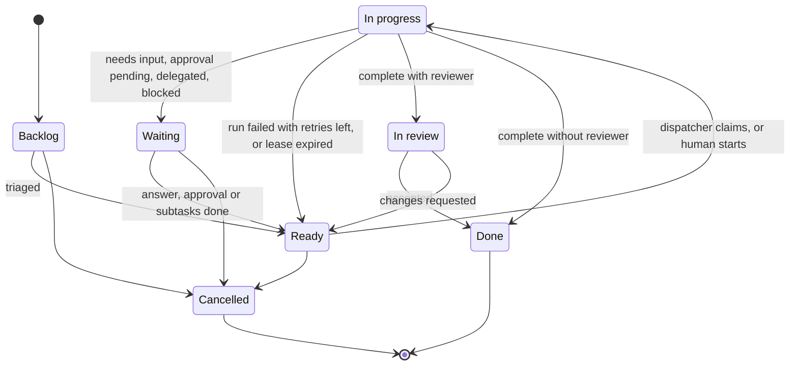
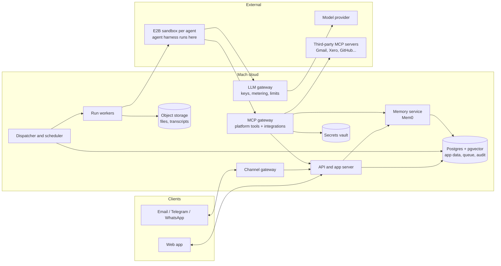

# Mach: Product Specification

| | |
|---|---|
| **Status** | Draft v0.1. A starting point for discussion |
| **Date** | 2026-10-06 |
| **Owner** | TBD |

> Everything here is a proposal to react to. Items marked **[Decision Dn]** need a call before we build; they are collected in [§14 Open questions](#14-open-questions-and-decisions).

## Contents

1. [Summary](#1-summary)
2. [Problem and opportunity](#2-problem-and-opportunity)
3. [Goals, non-goals, assumptions](#3-goals-non-goals-assumptions)
4. [Product principles](#4-product-principles)
5. [Users and roles](#5-users-and-roles)
6. [Core concepts](#6-core-concepts)
7. [Feature specifications](#7-feature-specifications)
   - [F1 Company Profile](#f1-company-profile)
   - [F2 Company Brain](#f2-company-brain-memory)
   - [F3 Agents: Chief of Staff and workers](#f3-agents)
   - [F4 Task board and dispatcher](#f4-task-board-and-dispatcher)
   - [F5 Agent capabilities: MCP, skills, sandbox](#f5-agent-capabilities)
   - [F6 Communication channels](#f6-communication-channels)
   - [F7 Collaboration](#f7-collaboration)
   - [F8 Permissions, approvals, safety](#f8-permissions-approvals-safety)
   - [F9 Observability](#f9-observability)
   - [F10 Workspace setup and admin](#f10-workspace-setup-and-administration)
8. [Key user journeys](#8-key-user-journeys)
9. [Architecture](#9-architecture)
10. [Non-functional requirements](#10-non-functional-requirements)
11. [Phased roadmap](#11-phased-roadmap)
12. [Success metrics](#12-success-metrics)
13. [Risks](#13-risks)
14. [Open questions and decisions](#14-open-questions-and-decisions)
- [Appendix A: What we borrow from personal agents](#appendix-a-what-we-borrow-from-personal-agents)

---

## 1. Summary

Mach is a command center for running a small or medium-sized business. In one workspace, **people work with people, people work with AI agents, and agents work with each other** to get the company's work done.

Every company on Mach gets:

- a **Company Profile** describing who the company is, who does what and who reports to whom,
- a **Company Brain** where agents store what they learn,
- a **Chief of Staff**, the coordinator agent that runs the agent team,
- **worker agents** the company creates for specific jobs (coder, data entry, bookkeeper…),
- a **Kanban board** where tasks go to humans or agents, and a **dispatcher** that starts agents automatically when their work is ready,
- **channels** (WhatsApp, Telegram, email, in-app), ticked per agent, so people can talk to agents from wherever they already work.

Agents should be as capable as open-source personal agents like OpenClaw and Hermes Agent: tools over MCP, skills, a sandboxed cloud computer (E2B), memory, schedules, messaging. The difference is that Mach agents work for a company rather than for one person.

## 2. Problem and opportunity

- **SMEs run on a patchwork** of email, WhatsApp groups, spreadsheets, a task tool and a handful of SaaS apps. Much of what the business knows sits in the founder's head.
- **Today's capable agents are personal.** OpenClaw and Hermes Agent each serve one user on one machine with one memory. They don't know the org chart, can't share work with colleagues, and don't hand off to other agents.
- **"AI features" in business tools are chatbots bolted onto existing products.** In those tools the agent is a feature, not a teammate who owns work.

**Mach's bet:** an SME gets more done when agents are members of the company. Each agent has a job description, a manager, a task queue and a way to reach it. It can read shared company knowledge, and the whole team, human and agent, works from the same board.

## 3. Goals, non-goals, assumptions

### Goals (v1)

1. A founder goes from sign-up to a Chief of Staff that knows the company **in one conversation (< 30 min)**.
2. Any member can **create a worker agent** from a template or by describing the job, without writing code.
3. A task assigned to an agent **starts automatically**, runs in a sandbox, and ends with either a reviewable result or a clear question for a human.
4. **Agents learn.** Corrections and discoveries go into the Company Brain and change what agents do next time.
5. Members **reach agents on the channels they already use**.
6. **Owners stay in control** through approvals for risky actions, spend limits and a full audit trail.

### Non-goals (v1)

- Structured HR/ERP data (payroll, contracts, headcount planning). The profile is text.
- Building our own memory engine, sandbox or LLM. We integrate existing components behind interfaces.
- Replacing Slack/Teams as the company's general chat. Human↔human collaboration in v1 centers on tasks and shared threads.
- Customer-facing agents, i.e. agents talking to the company's own customers or suppliers. Likely v2 ([D8](#14-open-questions-and-decisions)).
- Native mobile apps. In v1 the channels are the mobile experience, and the web app is responsive.
- Self-hosted / on-prem deployment.

### Assumptions from the brief

- **"Coordinator" and "Chief of Staff" are the same agent:** one per workspace, created automatically.
- **"MCP and skills" support** means: tools via the Model Context Protocol, plus packaged procedures in the open Agent Skills (`SKILL.md`) format used by OpenClaw and Hermes Agent.
- **E2B is the default sandbox**, behind an interface so we can switch providers.
- **Company knowledge is free text**, not hard data. We add structure only where the platform can't function without it.

## 4. Product principles

1. **Humans and agents are both Members.** They share the same primitives: profile, role, manager, inbox, channels, task assignments, permissions. Anything you can do with a human teammate (assign, mention, message, review), you can do with an agent.
2. **Text over schema.** Company knowledge is prose that humans and agents both read and edit.
3. **The board is the source of truth for work.** Agents delegate to each other through tasks, not hidden side channels, so all work is visible, attributable and resumable.
4. **Everything is observable.** We log every run, tool call, message, memory write and approval, and let people inspect them.
5. **Safe by default, autonomous by choice.** New agents start conservative. Owners raise autonomy per agent and per action.
6. **Buy or borrow before we build.** Sandbox (E2B), memory (open source), tools (MCP), skills (open format), channels (official APIs). Our value is the orchestration and the experience.
7. **Platform as MCP.** Mach's own capabilities (tasks, messaging, brain, profile) reach agents through an MCP server. That keeps the agent runtime swappable and leaves room for third-party agents to join a workspace later.

## 5. Users and roles

| Persona | Description | Typical needs |
|---|---|---|
| **Owner / founder** | Creates the workspace; ultimately accountable | Build the profile, create agents, approve risky actions, see what's happening |
| **Manager** | Runs a team or function | Assign work to humans and agents, review outputs |
| **Team member** | Does the work | Pick up tasks, ask agents for help from their phone, hand off grunt work |
| **Chief of Staff** (agent) | One per workspace, created automatically | Keep the profile current, triage requests, plan and delegate, chase progress, report |
| **Worker agent** | Created by members | Do a specific job: coding, data entry, bookkeeping, research, drafting… |

Human workspace roles are **Owner, Admin, Member, Guest** ([F8](#f8-permissions-approvals-safety)). Agents get permissions per agent rather than from these roles.

## 6. Core concepts

| Concept | Definition |
|---|---|
| **Workspace** | One company (tenant). All data is scoped to a workspace. |
| **Member** | A human or an agent in a workspace. Members can be assigned work, mentioned and messaged. |
| **Chief of Staff (CoS)** | The workspace's coordinator agent. Exactly one per workspace. It can't be deleted but can be renamed. |
| **Worker agent** | Any other agent, defined by its job description, instructions, tools, skills, channels and limits. |
| **Company Profile** | Curated, human-approved text describing the company. Loaded into every agent's context. |
| **Company Brain** | Memories agents accumulate about the company, its people, customers and procedures. Retrieved when relevant. |
| **Task** | A unit of work on the board with one assignee, human or agent. Can have subtasks and dependencies. |
| **Dispatcher** | The service that detects agent tasks ready to start and starts runs for them. |
| **Run** | One execution of an agent, triggered by a task, message, schedule, approval or another agent. Each run has a transcript, a cost and an outcome. |
| **Sandbox** | An isolated cloud computer (E2B) where an agent runs code, uses a browser and works with files. |
| **Integration / tool** | A capability exposed over MCP (Gmail, Xero, GitHub, HubSpot…) or built in. |
| **Skill** | A packaged procedure (`SKILL.md` plus optional scripts) that teaches an agent to do a specific job. |
| **Channel** | A way to reach a member: in-app, email, Telegram, WhatsApp. |
| **Thread** | A conversation between members, in any mix of humans and agents, on any channel. |
| **Approval** | A request from an agent asking a human to allow an action before it happens. |

---

## 7. Feature specifications

Priorities: **P0** = MVP · **P1** = fast follow · **P2** = later.

### F1. Company Profile

**Purpose.** A living description of the company. Every agent reads it before doing anything, and new humans can read it to onboard.

**Shape.** A small set of markdown sections, not a database. Suggested defaults, which members can edit, add to or remove:

| Section | Contents |
|---|---|
| Overview | What we do, for whom, where; size and stage |
| Mission, Vision, Values | In the company's own words |
| Goals | Current objectives and priorities for this quarter |
| People & Responsibilities | Who's who, who reports to whom, who owns what, how to reach them |
| Agents | The agent team and what each agent does (maintained automatically) |
| Products & Services | What we sell and how |
| Customers & Market | Who buys, key accounts, competitors |
| How We Work | Policies, tone of voice, approval norms, working hours, tools we use |
| Glossary | Internal terms, acronyms, codenames |

| ID | Pri | Requirement |
|---|---|---|
| PROF-1 | P0 | **Onboarding interview.** When a workspace is created, the CoS interviews the owner (in-app or on a channel) and drafts the profile. It keeps asking follow-up questions until each core section has content or the owner explicitly skips it. |
| PROF-2 | P0 | **Updates by chat.** Any member can tell the CoS a change ("Sam now runs sales and Priya reports to Sam"), and the CoS proposes the edit. |
| PROF-3 | P0 | **Direct editing** in a markdown/rich-text editor. |
| PROF-4 | P0 | **Versioning.** Every change records the author (human or agent), timestamp, diff and reason. Any version can be restored. |
| PROF-5 | P0 | **Change control.** By default, agent-proposed edits need owner/admin approval. A toggle lets the CoS edit without approval. |
| PROF-6 | P0 | **Context injection.** Every agent run includes the profile, compressed if it exceeds a token budget. Sections can be marked *load on demand* to keep the always-loaded part small. |
| PROF-7 | P1 | **Org chart view**, rendered from the People section. Read-only; the text stays the source of truth. |
| PROF-8 | P1 | **Staleness nudges.** The CoS asks owners to confirm sections that haven't changed in N months or that conflict with recent Brain memories. |
| PROF-9 | P2 | **Import** a starting profile from a website URL, pitch deck, existing documents or a company LinkedIn page. |

> **Members vs. profile.** Member records (human/agent, login, channels) are structured because assignment, auth and messaging depend on them. Titles, responsibilities and reporting lines live in profile text. **[Decision D2]** Should each member also get one optional `manager` link, used only to route approvals and escalations? *Recommendation: yes.* The org would still be described in prose.

### F2. Company Brain (memory)

**Purpose.** Where agents store what they learn on the job, so the company gets smarter over time.

| | Company Profile | Company Brain |
|---|---|---|
| Written by | Humans (agents propose) | Agents (humans curate) |
| Content | Canonical, curated narrative | Many small facts, preferences and procedures |
| Loaded | Always, in context | Retrieved when relevant |
| Example | "We sell refurbished farm equipment across the UK." | "Acme's invoices arrive as PDFs from billing@acme.example, with the VAT number on page 2." |

**Memory types:**
- *Facts* about the company, customers, suppliers and systems
- *Preferences* of people, e.g. "The founder wants summaries as bullet points"
- *Procedures*, e.g. "To issue a refund: …". These graduate into skills ([F5.3](#f53-skills)).
- *Episodes*: what happened on a task, its outcome, lessons learned

**Scopes:**
- *Workspace*: shared by all agents
- *Agent*: private to one agent
- *Person*: about or for a specific human
- *Project/task* (P1)

| ID | Pri | Requirement |
|---|---|---|
| BRAIN-1 | P0 | Agents have tools to `remember`, `recall` (semantic + keyword), `update` and `forget` memories. |
| BRAIN-2 | P0 | **Automatic extraction.** After each run and conversation, a background step pulls out candidate memories (corrections, new facts, preferences) and stores them with provenance: run, message, author. |
| BRAIN-3 | P0 | Relevant memories are injected when a run starts (based on the task or message), and agents can search for more during the run. |
| BRAIN-4 | P0 | **Brain UI.** Browse, search, filter by scope/type/agent, edit, delete, pin, and see provenance ("learned from task #142 on 3 Oct"). |
| BRAIN-5 | P0 | **Dedup and conflicts.** A memory that contradicts an existing one supersedes it, and the history is kept. Facts carry valid-from/valid-to dates where possible. |
| BRAIN-6 | P1 | **Restricted memories** visible only to named agents/humans. PII redaction rules. |
| BRAIN-7 | P1 | **Brain → Profile promotion.** The CoS suggests moving stable, frequently used memories into the profile. |
| BRAIN-8 | P1 | **Session search.** Full-text search across past conversations and run transcripts, for Hermes-style cross-session recall. |
| BRAIN-9 | P2 | **Knowledge sources.** Index uploaded documents and connected drives (Google Drive, SharePoint) as read-only knowledge alongside memories. |

**Implementation.** We use an open-source memory layer behind an internal `MemoryService` interface.

- **Recommended for v1: [Mem0](https://github.com/mem0ai/mem0) (open source)** using Postgres/pgvector as the vector store. It has a simple add/search API and built-in LLM extraction and dedup, and its user/agent/run scoping maps onto our scopes. Data stays in our primary database.
- **Spike alternatives:**
  - [Graphiti](https://github.com/getzep/graphiti), a temporal knowledge graph. It is strongest on facts that change over time, such as people, roles and customers.
  - [Cognee](https://github.com/topoteretes/cognee), graph + vector pipelines. A good fit for document knowledge (BRAIN-9).
- **[Decision D4]** Choose after a short spike comparing recall quality on a seeded sample company.

### F3. Agents

#### F3.1 Chief of Staff (coordinator)

Every workspace starts with one. It is the default entry point: *if you don't know who to ask, ask the Chief of Staff.*

Responsibilities:
- **Profile keeper.** Runs the onboarding interview and keeps the profile current ([F1](#f1-company-profile)).
- **Triage.** Takes requests from any channel and either answers directly, creates tasks, or routes them to the right human or agent.
- **Plan and delegate.** Breaks goals into tasks and subtasks, assigns them and sets dependencies.
- **Follow up.** Chases overdue or blocked work, nudges humans, escalates to managers.
- **Report.** Sends owners a daily or weekly brief: what got done, what's stuck, what needs a decision, what it cost.
- **Staffing.** Notices capability gaps ("invoice tasks keep arriving with no owner") and proposes new worker agents for approval.
- **Brain hygiene.** Resolves memory conflicts and promotes stable facts into the profile.

| ID | Pri | Requirement |
|---|---|---|
| COS-1 | P0 | Created automatically with sensible defaults. Can't be deleted; can be renamed, given a new avatar and reconfigured. |
| COS-2 | P0 | Platform tools to read the whole board, create/assign/update any task, message any member and create **draft** agents. |
| COS-3 | P0 | Scheduled daily brief to owners on their preferred channel. Time and days are configurable. |
| COS-4 | P1 | **Board watcher.** A periodic sweep for stale, overdue, blocked or unassigned tasks; the CoS acts or escalates. |
| COS-5 | P1 | **Triage-only mode.** The CoS never executes work itself and only routes it. |

#### F3.2 Worker agents

Each agent is defined on an Agent Settings page. Every field is editable, and each change creates a new version:

| Field | Notes |
|---|---|
| Name, avatar | Shown wherever members appear |
| Role / title | e.g. "Bookkeeper" |
| Job description | Plain language: what it's responsible for and what good looks like. Also the core of its system prompt. |
| Instructions | Detailed guidance, do's and don'ts |
| Manager | The human (or the CoS) who gets its escalations and approval requests |
| Model | Workspace default, overridable per agent ([§9.3](#93-models)) |
| Tools & integrations | MCP servers and tools it may use, each with a policy: allow / ask / deny |
| Skills | Attached from the workspace skill library |
| Sandbox template | Base, Coder (git, Node, Python), Browser (headless Chromium), Data (Python, pandas)… |
| Channels | Tick boxes: In-app (always on), Email, Telegram, WhatsApp ([F6](#f6-communication-channels)) |
| Brain access | Which memory scopes it can read and write |
| Schedules | Recurring jobs, e.g. "every weekday at 08:00, check the orders inbox" |
| Autonomy level | Preset approval policies: Supervised / Standard / Autonomous ([F8](#f8-permissions-approvals-safety)) |
| Limits | Max concurrent runs, max run duration, spend per run/day/month |
| Status | Draft → Active → Paused → Archived |

| ID | Pri | Requirement |
|---|---|---|
| AGT-1 | P0 | **Create from a template.** Built-in templates: Coder, Data Entry, Researcher, Bookkeeper, Support Drafter, Content Writer, Sales Assistant, Ops Assistant. A template is a pre-filled definition plus recommended tools, skills and sandbox. |
| AGT-2 | P0 | **Create by conversation.** A member says "I need someone to chase unpaid invoices"; the CoS drafts a full definition; a human reviews it and activates it. |
| AGT-3 | P0 | **Create from scratch** with the settings form. |
| AGT-4 | P0 | **Agent page** showing live activity, assigned tasks, recent runs, threads, memories, spend and config history. |
| AGT-5 | P0 | **Pause/resume.** A paused agent gets no dispatched work. Inbound messages get an auto-reply and go to its manager. |
| AGT-6 | P1 | **Test drive.** Run a draft agent on a sample task in dry-run mode: no external side effects, approvals auto-denied. |
| AGT-7 | P1 | **Clone**, and export/import an agent definition as a file (agent-as-code). |
| AGT-8 | P2 | Template marketplace shared across workspaces. |

#### F3.3 Lifecycle

- A config change creates a new agent version. Runs already in progress keep the version they started with; the next run uses the new one.
- Archiving an agent reassigns its open tasks to its manager (or the CoS) and turns off its channels.

### F4. Task board and dispatcher

#### F4.1 Board

**Canonical statuses.** Teams can rename columns or add new ones, but every column maps to one canonical status so the dispatcher knows what it means:

| Canonical status | Meaning |
|---|---|
| **Backlog** | Captured, not ready to start |
| **Ready** | Ready to work on. If the assignee is an agent, the dispatcher starts it. |
| **In progress** | A human is working on it, or an agent run is active |
| **Waiting** | Blocked on a human answer, an approval, a dependency or subtasks |
| **In review** | Work done, waiting for the reviewer to accept it |
| **Done** | Accepted / complete |
| **Cancelled** | Won't do |



| ID | Pri | Requirement |
|---|---|---|
| BRD-1 | P0 | One default company board. P1: several boards (per team or project) and saved views (by assignee, label, human vs. agent). |
| BRD-2 | P0 | Columns map to canonical statuses (above). |
| BRD-3 | P0 | **Task fields:** title; description (markdown); assignee (exactly one member, or unassigned); creator; reviewer (optional, defaults to the creator for agent-assigned tasks); status; priority; due date; start-after date; labels; parent; blocked-by dependencies; acceptance criteria; attachments; comments and activity; outputs (files, links, summaries); linked runs; cost so far. |
| BRD-4 | P0 | **Subtasks** are tasks with a parent. The data model allows any depth; the task drawer shows them as a nested list, and parents show rolled-up progress. By default (configurable), a parent can't be Done while it has open subtasks. |
| BRD-5 | P0 | **Dependencies.** A task becomes dispatchable only when every blocked-by task is Done. |
| BRD-6 | P0 | **Ways to create tasks:** the board UI; chat with any agent ("make a task for…"); email or Telegram to the CoS; agents themselves (delegation). |
| BRD-7 | P0 | **Comments and @mentions** from humans and agents. Mentioning a member notifies them; mentioning an agent also wakes it ([DSP-2](#f42-dispatcher)). |
| BRD-8 | P0 | **Realtime updates.** Agent-assigned cards show live run progress. |
| BRD-9 | P1 | **Recurring tasks** (cron-like), e.g. "Every Monday: prepare the weekly sales report". |
| BRD-10 | P1 | Task templates and checklists. |
| BRD-11 | P2 | List, calendar and timeline views. |

#### F4.2 Dispatcher

A task is **dispatchable** when all of these hold:

1. Its status is **Ready**.
2. Its assignee is an **Active agent**.
3. Every blocked-by dependency is **Done**.
4. Its `start_after` is empty or in the past.
5. No active run already holds it.
6. The agent is under its concurrency limit, and both the agent and the workspace are under budget.

For a dispatchable task, the dispatcher **claims it atomically** (a lease), sets it to In progress, creates a Run and starts the agent. The agent starts with:
- the company profile,
- the task, with its parent chain, sibling summaries, comments and attachments,
- relevant Brain memories,
- its tools and skills.

**Triggers.** The dispatcher is event-driven: it reacts when a task is created, updated or assigned, a dependency completes, an approval is resolved, a comment or mention is added, an agent is un-paused, or a budget resets. A periodic sweep (every 30–60 s) catches anything the events miss.

**Run outcomes.** An agent ends its run by calling exactly one outcome tool:

| Outcome | Task moves to | Side effects |
|---|---|---|
| `complete(summary, outputs)` | In review if a reviewer is set, otherwise Done | Outputs attached, summary comment posted, reviewer notified |
| `needs_input(question, ask?)` | Waiting | Question goes to the requester or manager on their channel; their reply wakes the agent |
| `delegated(subtasks)` | Waiting | Agent resumes automatically when every subtask finishes |
| `blocked(reason)` | Waiting | Manager notified |
| *(error or timeout)* | Ready with backoff retry (max 3), then Waiting | Error recorded; manager notified after the final failure |

| ID | Pri | Requirement |
|---|---|---|
| DSP-1 | P0 | **At-least-once dispatch with exactly one active run per task.** A database lease with an expiry, renewed by the run's heartbeat. If the lease expires, the task returns to Ready and the run is marked lost. |
| DSP-2 | P0 | **Wake-ups.** A new comment or mention, a human reply to `needs_input`, an approval decision, or subtask completion starts a new run on the same task with the new input. The conversation continues, with earlier context summarized. |
| DSP-3 | P0 | **Review loop.** If the reviewer requests changes, the task returns to Ready with the review comments and the agent runs again. |
| DSP-4 | P0 | **Limits.** Per-run max duration and spend; per-agent and per-workspace concurrency. |
| DSP-5 | P0 | **Human assignees** aren't "run". The dispatcher notifies them of assignments and due dates on their preferred channel. |
| DSP-6 | P1 | **Priority and fairness.** The ready queue is ordered by priority, due date and age, with fair share across agents. |
| DSP-7 | P1 | **Loop protection.** Max delegation depth (e.g. 5), a max number of subtasks per run, and detection of agents bouncing work back and forth. Violations escalate to the CoS or a manager. |
| DSP-8 | P1 | **Manual controls:** *Run now*, *Stop run*, *Retry*, *Take over* (reassign to me with the transcript). |

Claim sketch. A single statement, safe under concurrency; budget and concurrency checks happen just before it:

```sql
UPDATE task
SET status = 'in_progress',
    lease_run_id = :run_id,
    lease_expires_at = now() + interval '5 minutes'
WHERE id = (
  SELECT t.id
  FROM task t
  JOIN agent a ON a.member_id = t.assignee_member_id
  WHERE t.workspace_id = :workspace_id
    AND t.status = 'ready'
    AND a.status = 'active'
    AND (t.start_after IS NULL OR t.start_after <= now())
    AND NOT EXISTS (
      SELECT 1
      FROM task_dependency d
      JOIN task b ON b.id = d.blocked_by_task_id
      WHERE d.task_id = t.id AND b.status <> 'done'
    )
  ORDER BY t.priority DESC, t.due_at NULLS LAST, t.created_at
  LIMIT 1
  FOR UPDATE SKIP LOCKED
)
RETURNING id;
```

### F5. Agent capabilities

**The bar:** anything a well-configured OpenClaw or Hermes agent can do for one person, a Mach agent can do for a company.

| Capability | Mach | Pri |
|---|---|---|
| Tools via MCP | Workspace MCP registry with per-agent grants | P0 |
| Skills | Workspace library in the open `SKILL.md` format; importable; agents can propose new ones | P0 / P1 |
| Sandbox computer | One E2B sandbox per agent | P0 |
| Web search and fetch | Built in | P0 |
| Browser automation | Headless browser in the sandbox | P0 |
| Visual computer use | Desktop sandbox | P2 |
| Memory | Company Brain ([F2](#f2-company-brain-memory)) | P0 |
| Schedules / heartbeats | Agent schedules | P1 |
| Subagents | Short-lived parallel helpers within a run | P1 |
| Messaging channels | [F6](#f6-communication-channels) | P0 / P1 |
| Voice notes | Inbound transcription | P1 |
| Self-improvement | Post-run reflection writes memories and proposes skills | P1 |

#### F5.1 Built-in platform tools ("Mach MCP")

Exposed to every agent as an MCP server and filtered by that agent's permissions:

- **Tasks:** list/search, get, create (including subtasks), update, comment, assign, plus the outcome tools (`complete`, `needs_input`, `delegated`, `blocked`)
- **People and agents:** list members, get a member's profile, look up who owns what
- **Messaging:** message a member or thread, ask a human a blocking question, request approval
- **Brain:** remember, recall, update, forget
- **Profile:** read, propose an edit
- **Files:** read and write workspace files and task attachments
- **Schedules** (P1): create, list and cancel its own schedules
- **Agents** (CoS by default): draft an agent, list agents

#### F5.2 MCP integrations

| ID | Pri | Requirement |
|---|---|---|
| MCP-1 | P0 | **Workspace MCP registry.** Admins add remote MCP servers (Streamable HTTP) by URL. Mach handles the OAuth flows and stores credentials in the vault. |
| MCP-2 | P0 | **Curated catalog** of common SME integrations: Google Workspace, Microsoft 365, Slack, Notion, HubSpot, Xero/QuickBooks, Stripe, Shopify, GitHub, Airtable. Only where a maintained MCP server exists. |
| MCP-3 | P0 | **Per-agent grants**, by server and by tool, each with a policy: allow / ask / deny. |
| MCP-4 | P0 | **Credentials never reach the model or the sandbox.** Remote MCP calls go through Mach's MCP gateway, which injects credentials and logs every call. |
| MCP-5 | P1 | **Local (stdio) MCP servers** run inside the agent's sandbox from a package spec (npm, pip or container image). |
| MCP-6 | P1 | **Per-person connections.** An agent working for a specific human can use that human's own OAuth connection (e.g. their mailbox) when allowed. |
| MCP-7 | P1 | **Large catalogs.** Tool search / deferred loading so dozens of tools don't flood the context window. |

#### F5.3 Skills

| ID | Pri | Requirement |
|---|---|---|
| SKL-1 | P0 | **Open format.** A skill is a folder with `SKILL.md` and optional scripts and resources, in the Agent Skills standard also used by Claude, OpenClaw and Hermes Agent. Community skills therefore work in Mach. |
| SKL-2 | P0 | **Workspace skill library.** Upload or write skills in an editor, version them, attach them to agents. |
| SKL-3 | P0 | **Progressive disclosure.** Agents see only skill names and descriptions until a skill is relevant; then the full content loads. |
| SKL-4 | P1 | **Import** from public registries (ClawHub, the Hermes Skills Hub, GitHub). Skills can contain scripts, which is a supply-chain risk, so imports are scanned and need admin approval. |
| SKL-5 | P1 | **Agent-authored skills.** After a novel multi-step task, an agent can propose a new skill or an improvement to an existing one. A human approves it before it's published to the library. |

#### F5.4 Sandbox

| ID | Pri | Requirement |
|---|---|---|
| SBX-1 | P0 | **Every agent has an [E2B](https://e2b.dev) sandbox** for shell commands, code, file work, a headless browser and local MCP servers. |
| SBX-2 | P0 | **Persistence.** Each agent has one long-lived sandbox, paused between runs and resumed on the next one, so installed packages, repos and files survive. The sandbox is not the system of record: durable outputs are synced to Mach file storage. If a resume fails, a fresh sandbox is created from the template. |
| SBX-3 | P0 | **Sandbox templates** per agent type (custom E2B templates): Base, Coder, Browser, Data. |
| SBX-4 | P0 | **Egress logging.** Network egress is open by default and logged. P1: restrict an agent to allowlisted domains. |
| SBX-5 | P0 | **No long-lived secrets in sandboxes.** Model calls go through Mach's LLM gateway using a short-lived per-run token. Integration credentials stay in the MCP gateway. |
| SBX-6 | P1 | **Live view.** Humans can watch terminal output and browser screenshots during a run, and download the sandbox's files. |
| SBX-7 | P1 | **Cost hygiene.** Track sandbox cost; reap snapshots unused for N days, since paused-sandbox storage is billed. |
| SBX-8 | P2 | **Desktop sandboxes** for visual computer use with GUI apps. |

The sandbox sits behind a `SandboxProvider` interface (`create`, `resume`, `pause`, `exec`, `files`, `destroy`) so Daytona, Modal or self-hosted Firecracker can be added later.

#### F5.5 Schedules, heartbeats, subagents

| ID | Pri | Requirement |
|---|---|---|
| SCH-1 | P1 | **Agent schedules**, as cron or natural language ("every weekday at 8"). Each firing starts a run with a standing instruction, like an OpenClaw heartbeat checklist. |
| SCH-2 | P1 | **Subagents.** Within one run, an agent can spawn short-lived helpers for parallel sub-work, with the same or narrower permissions; their results return to the parent. Delegating to *named* agents is different and always goes through the board. |

#### F5.6 Context management

| ID | Pri | Requirement |
|---|---|---|
| CTX-1 | P0 | **Long runs** compact or summarize earlier turns. Large tool outputs are truncated in context, and the full version is saved as a file. |
| CTX-2 | P0 | **Context order** at run start: agent definition and platform rules → company profile → skills index → relevant memories → task or thread context. Stable content comes first so prompt caching works. |

### F6. Communication channels

Every agent has an in-app inbox. Other channels are tick boxes on the agent's settings page.

| Channel | Pri | How it works | Notes |
|---|---|---|---|
| **In-app** | P0 | DMs and group threads in the web app | Always on |
| **Email** | P0 | Each agent gets an address like `bookkeeper@<workspace>.<our-mail-domain>`. P1: custom domain (`bookkeeper@acme.co.uk`). | Inbound via provider webhook (Postmark / SES). Threading via `Message-ID` / `In-Reply-To`. SPF/DKIM/DMARC checks for sender verification. |
| **Telegram** | P0 | One Telegram bot per agent: the owner creates it in BotFather and pastes the token, or follows a guided flow | Free and simple, with inline buttons (good for approvals), voice notes and files |
| **WhatsApp** | P1, gated | WhatsApp Business Platform (Cloud API). One number per workspace, owned by the company via Embedded Signup. | See constraints below |
| Slack / Teams | P2 | One app per workspace; agents appear as bot users | |
| SMS / voice calls | P2 | | |

| ID | Pri | Requirement |
|---|---|---|
| CHN-1 | P0 | **Channel toggles** per agent, with guided setup and a "send test message" step. |
| CHN-2 | P0 | **Identity linking.** Each human links their channel identities (email addresses, Telegram account, WhatsApp number) by verification code or magic link. Inbound messages are attributed to that member, and that member's permissions apply. |
| CHN-3 | P0 | **Unknown senders.** A per-agent policy: ignore, forward to the manager, or send a canned reply. Default: forward to the manager. **Agents never act on instructions from unverified senders.** (External contacts like customers and suppliers: P2, [D8](#14-open-questions-and-decisions).) |
| CHN-4 | P0 | **Unified threads.** Messages from every channel land in one thread per (member, agent), marked with channel badges. Agents reply on the channel the message came in on, and a conversation can move across channels. |
| CHN-5 | P0 | **Proactive outbound.** Agents message humans (questions, approvals, completions, briefs) on the human's preferred channel and respect quiet hours. |
| CHN-6 | P0 | **Approvals and questions in-channel**: inline buttons on Telegram; reply keywords ("approve 4821") or a deep link on email/WhatsApp. |
| CHN-7 | P0 | **Attachments** (images, PDFs, documents) in both directions. Inbound files are saved to the thread and made available in the agent's sandbox. |
| CHN-8 | P1 | **Voice notes** are transcribed and treated as text. P2: reply by voice. |
| CHN-9 | P1 | **Group threads** with humans and several agents. An agent responds when @mentioned, or the CoS moderates. |
| CHN-10 | P1 | **Shared entry point.** One WhatsApp/Telegram contact for the workspace, routed by the CoS ("@bookkeeper, …" or inferred from the message). |

**WhatsApp constraints. Resolve these before we build ([D5](#14-open-questions-and-decisions)):**

1. **Meta policy.** Since 15 Jan 2026, WhatsApp Business Solution terms prohibit providers whose *primary* function is distributing a general-purpose AI assistant. AI used inside a business's own service (support, bookings, operations) is allowed. An internal "chat with your AI staff" product is a grey zone and needs policy/legal review. The architecture should have each company connect **its own** WhatsApp Business account, so the business is the sender, using its agents for its own business.
2. **24-hour window.** Messages the business initiates more than 24 hours after the user's last message need pre-approved templates and are charged per message. That affects proactive briefs and approval requests.
3. **Provisioning.** Business verification and number setup take days to weeks, so a number per agent is impractical. Use one number per workspace with CoS routing (CHN-10).
4. **No unofficial bridges.** WhatsApp Web bridges, which personal agents often use, violate WhatsApp's terms and risk the number being banned. Not acceptable for a business product.

**→ MVP ships Telegram and email. WhatsApp follows the policy review.**

### F7. Collaboration

| Interaction | Mechanisms |
|---|---|
| **Human ↔ human** | Task comments and mentions, group threads, shared board, reassignment |
| **Human ↔ agent** | DMs on any channel, task assignment, mentions, output review, answering questions, approving actions, taking over a run |
| **Agent ↔ agent** | Delegation via subtasks, ask-an-agent questions, mentions in threads |

| ID | Pri | Requirement |
|---|---|---|
| COL-1 | P0 | **Delegation through the board.** Agent A creates a subtask and assigns it to agent B. A's task waits; when B finishes, B's output flows back to A. Any agent can delegate to agents. Only the CoS and agents with a "can assign humans" permission can delegate to humans. |
| COL-2 | P1 | **Ask an agent.** An agent can ask another agent a quick question. This runs the target briefly and returns the answer. It is logged on both agents, and the target's own permissions apply (no borrowing privileges). |
| COL-3 | P0 | **Activity feed.** A workspace-wide, filterable stream of notable events: tasks created or completed, approvals, agents created, Brain and profile changes. |
| COL-4 | P0 | **Notifications.** Each human sets preferences per event type and channel, quiet hours, and digest mode. |
| COL-5 | P1 | **Handoffs.** An agent can hand a task to a human with a structured summary (what's done, what's left, where the files are), and the human can hand it back. |
| COL-6 | P1 | **Mixed group threads** ([CHN-9](#f6-communication-channels)). |

Agent↔agent work counts against both agents' budgets and against the delegation-depth limit ([DSP-7](#f42-dispatcher)).

### F8. Permissions, approvals, safety

| ID | Pri | Requirement |
|---|---|---|
| SEC-1 | P0 | **Human roles.** Owner and Admin manage agents, integrations and billing. Members create tasks and talk to agents. Guests see only what they're invited to. |
| SEC-2 | P0 | **Agent permissions:** tool grants (MCP-3), Brain scopes, which members it may message or assign to, whether it may create subtasks or agents. |
| SEC-3 | P0 | **Action policies** of Allow / Ask first / Deny, set per tool or per category. Defaults are in the table below. |
| SEC-4 | P0 | **Autonomy presets.** *Supervised* asks before any side effect outside Mach. *Standard* uses the defaults below. *Autonomous* asks only for categories explicitly set to Ask. **[Decision D7]** default for new agents. |
| SEC-5 | P0 | **Approval requests** show the exact action (tool, arguments and a rendered preview, e.g. the actual email), the reason and the task. They go to the agent's manager (fallback: owners) in-app and on the manager's preferred channel. Options: approve / deny / edit and approve / "always allow this for this agent". Requests expire after 24 h by default; expiry counts as a denial and the task moves to Waiting. |
| SEC-6 | P0 | **Budgets.** Spend caps (LLM + sandbox + paid tools) per run, per agent per day/month and per workspace per month. Alerts at 50/80/100%. At 100% runs stop and the owner is notified. |
| SEC-7 | P0 | **Audit log.** An immutable record of every action by every member, including tool calls with arguments, approvals and config changes. Exportable. |
| SEC-8 | P0 | **Secrets vault.** Integration credentials are encrypted with KMS, scoped per workspace or agent, and injected only at the gateway. |
| SEC-9 | P0 | **Prompt-injection posture.** Content from web pages, emails, files and unverified senders is untrusted data. Instructions come only from verified members. If a run's context includes untrusted content, its sensitive actions require approval regardless of policy. P1: per-run taint tracking. |
| SEC-10 | P0 | **Tenant isolation.** Every row is scoped by workspace with row-level security. Sandboxes are per agent. Memory never crosses workspaces. |
| SEC-11 | P1 | **Kill switch.** An owner can pause every agent with one click. |

Default action policies (*Standard* preset):

| Category | Default |
|---|---|
| Read data, search, draft, internal messages and tasks | Allow |
| Send externally: email to non-members, public posts | Ask |
| Spend money / make payments | Ask (Deny under *Supervised*) |
| Delete data in external systems | Ask |
| Create or modify financial records | Ask |
| Push to protected branches / deploy | Ask |

### F9. Observability

| ID | Pri | Requirement |
|---|---|---|
| OBS-1 | P0 | **Run viewer.** The full transcript (context, model responses, tool calls and results, sandbox commands and output, approvals), a timeline, tokens, cost, duration, and the model and agent version used. |
| OBS-2 | P0 | **Live view** of active runs, streamed. |
| OBS-3 | P0 | **Dashboard.** Tasks by status and assignee type, active runs, agent utilization, success rate, spend over time, pending approvals. |
| OBS-4 | P1 | **Agent scorecards.** Review outcomes (accepted first time vs. changes requested), human corrections and failed runs per agent. |
| OBS-5 | P1 | **Engineering tracing** with OpenTelemetry plus LLM tracing (e.g. Langfuse) for our own debugging. |

### F10. Workspace setup and administration

| ID | Pri | Requirement |
|---|---|---|
| ADM-1 | P0 | Sign-up by email magic link, Google or Microsoft. Creating a workspace creates its CoS, which starts the onboarding interview (PROF-1). |
| ADM-2 | P0 | Invite humans by email link; they verify their channels (CHN-2). |
| ADM-3 | P0 | The CoS proposes the first 1–3 worker agents based on the profile. |
| ADM-4 | P0 | Admin pages for integrations (MCP registry), the skills library, channels, budgets and the audit log. |
| ADM-5 | P0 | **Usage metering from day one** (tokens, sandbox seconds, messages per channel), so billing can be added later. |
| ADM-6 | P1 | Data export (profile, Brain, tasks, transcripts) and workspace deletion, for GDPR. |
| ADM-7 | P2 | SSO/SAML, SCIM. |

---

## 8. Key user journeys

### J1. Onboarding (target: under 30 minutes)

1. The founder of *Greenfield Supplies*, a farm-supplies business, signs up and creates a workspace.
2. The Chief of Staff introduces itself and starts the interview: what the company does, its customers and team, this quarter's goals, how the team likes to work.
3. The founder pastes the company website and answers some questions by Telegram voice note on the way to a customer (P1).
4. The CoS drafts the profile. The founder edits two lines and approves it.
5. The CoS suggests: *"From what you've told me, a Bookkeeper and an Inbox Assistant would save you the most time. Shall I set them up?"*

### J2. Creating an agent by conversation

1. The founder messages the CoS on Telegram: *"I need someone to enter supplier invoices into Xero every day."*
2. The CoS drafts a **Bookkeeper** agent:
   - job description and instructions,
   - Xero access, plus Gmail read access limited to the invoices label,
   - the Data sandbox and an "Enter supplier invoice" skill,
   - a weekday 09:00 schedule,
   - a policy to ask before creating any bill over £1,000,
   - an email address.
3. The founder opens the draft, connects Xero via OAuth and activates the agent.

### J3. A task from Ready to Done

1. The ops lead creates *"Reconcile September Stripe payouts with Xero"*, assigns it to the Bookkeeper, sets the founder as reviewer and moves it to Ready.
2. The dispatcher claims the task and starts a run; the card shows a live indicator.
3. The agent resumes its sandbox, pulls data over MCP, runs a Python script and finds two unmatched payouts.
4. It calls `needs_input`: *"Two payouts (£412, £96) have no matching invoice. Are these Etsy sales?"* The ops lead gets the question on Telegram and replies *"yes, Etsy"*.
5. The agent wakes up and finishes the reconciliation. It saves a memory: *"Small unmatched Stripe payouts are usually Etsy sales; check the Etsy export."* It attaches a reconciliation CSV and calls `complete`, which moves the task to In review.
6. The founder accepts it, and the task moves to Done.

### J4. Agents delegating to agents

1. The sales lead emails the CoS: *"Prepare a quote pack for Northfield Farms: 40 units of the X200, delivered to Leeds."*
2. The CoS creates a parent task with three subtasks:
   - *Price 40 units incl. volume discount* → Bookkeeper
   - *Get delivery cost to Leeds* → Ops Assistant
   - *Draft the quote PDF and cover email* → Content Writer, blocked by the first two
3. The first two subtasks run in parallel. When both finish, the dependency clears and the Content Writer runs, producing a PDF and a draft email.
4. Sending email outside the company needs approval, and the sales lead approves from their phone.
5. The parent task completes, and the CoS reports back to the sales lead.

### J5. Learning from a correction

1. A reviewer comments on an agent's draft: *"Never schedule deliveries on Fridays. Our courier doesn't collect."*
2. The agent revises the draft. Extraction stores a workspace memory, with provenance.
3. The following week another agent recalls the memory while drafting a delivery schedule and avoids Friday.
4. Later, the CoS suggests promoting the rule into the profile's *How We Work* section.

---

## 9. Architecture

### 9.1 Components



| Component | Responsibility |
|---|---|
| **API / app server** | Auth, workspace data, board, profile, agent config, approvals, realtime events to the web app |
| **Channel gateway** | Webhooks in and API calls out for email, Telegram and WhatsApp; identity resolution; durable inbound queue |
| **Dispatcher / scheduler** | Finds dispatchable tasks, fires schedules, handles wake-ups, leases and retries |
| **Run workers** | Own each run's lifecycle: prepare the sandbox and context, start the harness, stream events, post-run jobs |
| **MCP gateway** | One MCP endpoint per run. Serves platform tools and proxies third-party MCP servers, enforcing grants and policies, injecting credentials and logging calls. |
| **LLM gateway** | Holds provider keys, issues per-run tokens, meters usage, enforces budgets |
| **Memory service** | Mem0 behind `MemoryService`: extraction, search, dedup |

### 9.2 Agent runtime

**Run lifecycle:**

1. The dispatcher, a channel message or the scheduler creates a **Run** and queues it.
2. A run worker **resumes the agent's E2B sandbox**, or creates one from the template.
3. The worker **starts the agent harness inside the sandbox** with:
   - the assembled context ([CTX-2](#f56-context-management)),
   - a short-lived token for the LLM gateway,
   - an MCP config pointing at the Mach MCP gateway.
4. The harness runs the tool loop. **Every tool call passes a permission hook** that asks Mach for a policy decision (allow / ask / deny). "Ask" suspends the call until the approval is resolved; if waiting would be long, the run ends in Waiting and resumes later.
5. Events (messages, tool calls, outputs) stream back to Mach for the live view and transcript.
6. The run ends with an outcome tool call. Post-run jobs then extract memories, account for cost and send notifications, and the sandbox is paused.

**Harness options. [Decision D3]**

| Option | Pros | Cons |
|---|---|---|
| **A. Claude Agent SDK running inside the E2B sandbox** *(recommended)* | Complete harness out of the box: file, bash and web tools, MCP client, Agent Skills, subagents, context compaction and permission hooks. Closest to OpenClaw/Hermes versatility on day one, and works natively on the sandbox filesystem. | Tied to Claude models; some harness behavior is outside our control |
| B. Our own loop on a model API, with tools executed in E2B | Full control; provider-portable | We rebuild compaction, skill loading, subagents and file-editing tools |
| C. Claude Managed Agents (hosted loop and sandbox) | Anthropic hosts the loop *and* the sandbox, with vaults, memory stores, scheduled sessions, multi-agent sessions and permission policies built in | Replaces E2B; beta; less control over the sandbox and data location |

**Recommendation:** Option A for v1, behind an `AgentRuntime` interface (`start(run)`, `send(input)`, `stop()`, event stream), so B or C can be plugged in per agent later. Run a one-week spike of C alongside, since it would remove most of the sandbox, vault and scheduling work.

### 9.3 Models

- Model choice is **configuration, not code**: a workspace default plus a per-agent override.
- **Starting default:** the current Opus-tier Claude model for the CoS and for workers. Smaller tiers are available per agent for high-volume or background work (memory extraction, inbound triage), decided by measuring **cost per completed task**, not per request.
- **[Decision D6]** Claude-only, or multi-provider and bring-your-own-key? Option A above implies Claude for the agent harness.

### 9.4 Proposed tech stack

| Layer | Proposal | Why |
|---|---|---|
| Language | TypeScript end to end; pnpm + Turborepo monorepo | One language for web, API and workers; strong MCP and agent SDK support |
| Web app | Next.js (React), Tailwind, shadcn/ui, dnd-kit for the board | Fast to build |
| API | Node service (Hono or Fastify), typed client (tRPC or OpenAPI) | Keeps long-lived workers separate from the web tier |
| Database | Postgres + pgvector, Drizzle ORM, row-level security per workspace | One datastore for app data, memory vectors and the job queue |
| Jobs / dispatch | Postgres-backed queue (pg-boss or Graphile Worker) | Transactional claims together with task state; fewer moving parts. Revisit Temporal/Inngest if workflows get complex. |
| Realtime | Server-sent events/WebSockets, fed by Postgres `LISTEN/NOTIFY` or a managed service (Ably / Pusher) | Live board and run views |
| Memory | Mem0 OSS (Python service) on pgvector | [F2](#f2-company-brain-memory) |
| Sandbox | E2B with custom templates | [F5.4](#f54-sandbox) |
| Agent harness | Claude Agent SDK inside the sandbox | [§9.2](#92-agent-runtime) |
| Files | S3-compatible object storage (S3 / R2) | |
| Email | Postmark or AWS SES (inbound and outbound) | |
| Telegram | Bot API with webhooks | |
| WhatsApp | WhatsApp Cloud API, directly or via a BSP | After [D5](#14-open-questions-and-decisions) |
| Auth | Better Auth or Clerk | |
| Secrets | Cloud KMS envelope encryption | |
| Observability | OpenTelemetry + Langfuse | |
| Hosting | UK/EU region | GDPR; customers' data locality |

### 9.5 Core data model

| Entity | Key fields |
|---|---|
| `workspace` | id, name, region, plan, settings |
| `member` | id, workspace_id, kind (`human`/`agent`), display_name, avatar, manager_member_id?, status |
| `human` | member_id, user_id, role, timezone, quiet_hours, notification_prefs |
| `agent` | member_id, is_coordinator, current_version_id, status |
| `agent_version` | id, agent_id, job_description, instructions, model, autonomy, limits, sandbox_template, created_by, created_at |
| `agent_tool_grant` | agent_id, mcp_server_id, tool (or `*`), policy (`allow`/`ask`/`deny`) |
| `agent_skill` | agent_id, skill_version_id |
| `channel_identity` | member_id, channel, external_id (email / Telegram id / phone / bot), verified_at |
| `channel_binding` | agent_id, channel, config_ref, status |
| `profile_section` | id, workspace_id, title, body_md, load_policy (`always`/`on_demand`), position |
| `profile_revision` | id, section_id, body_md, author_member_id, reason, status (`proposed`/`applied`/`rejected`) |
| `memory` *(in memory service)* | workspace_id, scope, scope_ref, type, text, source_run_id, source_message_id, pinned, restricted, valid_from/to |
| `board`, `board_column` | board: id, workspace_id, name · column: board_id, name, canonical_status, position |
| `task` | id, workspace_id, board_id, parent_id, title, description_md, acceptance_md, status, assignee_member_id, creator_member_id, reviewer_member_id, priority, due_at, start_after, lease_run_id, lease_expires_at, timestamps |
| `task_dependency` | task_id, blocked_by_task_id |
| `thread`, `message` | thread: id, kind (`dm`/`group`/`task`), participants · message: thread_id, author_member_id, channel, direction, external_id, body, attachments |
| `comment` | id, task_id, author_member_id, body_md, created_at |
| `run` | id, agent_id, agent_version_id, trigger (`task`/`message`/`schedule`/`agent`/`approval`), task_id?, thread_id?, status, outcome, sandbox_id, tokens, cost, started_at, ended_at, transcript_ref |
| `approval` | id, run_id, agent_id, action, args, preview, approver_member_id, status, expires_at, decided_at |
| `skill`, `skill_version` | skill: id, workspace_id, name, description · version: bundle_ref, status, author |
| `mcp_server` | id, workspace_id, name, url or package, auth_type, credential_ref |
| `schedule` | id, agent_id, cron, instruction, next_run_at |
| `audit_log` | id, workspace_id, actor_member_id, action, target, payload, at |
| `usage_record` | workspace_id, agent_id, run_id, kind, quantity, cost, at |

---

## 10. Non-functional requirements

| Area | Requirement |
|---|---|
| **Reliability** | No lost tasks (sweep + leases). Never two concurrent runs on one task. Runs survive worker restarts by resuming or restarting cleanly. Inbound channel messages are queued durably. |
| **Latency** | An inbound message gets an acknowledgment or typing indicator within 3 s. Simple questions get a meaningful first reply in about 15 s (P50). |
| **Scale (v1 target)** | 200 workspaces averaging 5 agents each; 100 concurrent runs at peak. All services scale horizontally. |
| **Security** | SOC 2-ready from the start: encryption at rest and in transit, least privilege, audit logs, KMS-managed secrets, dependency scanning. |
| **Privacy** | UK GDPR / GDPR: UK/EU data residency; DPAs with sub-processors (model provider, E2B, email/messaging providers); data export and deletion; no training on customer data. |
| **Cost control** | Cost per completed task visible per agent. Hard caps per workspace. |
| **Availability** | 99.5% for the web app and API in v1. |
| **Accessibility** | WCAG 2.1 AA for the web app. |

## 11. Phased roadmap

**Phase 0: Foundations**
- Workspaces, auth, members, in-app chat with the CoS
- Agent runtime: harness in an E2B sandbox, LLM gateway, Mach MCP (tasks, messaging, profile), run viewer
- Company Profile and the onboarding interview
- *Exit criterion:* a founder can onboard and chat with a CoS that knows the company and can do work in its sandbox.

**Phase 1: MVP**
- Board and dispatcher: statuses, subtasks, dependencies, outcomes, wake-ups, review loop
- Worker agents: templates, create-by-chat, settings page
- Company Brain (Mem0): extraction and UI
- MCP registry and gateway with 5–8 curated integrations; skills library
- Channels: email and Telegram
- Approvals, budgets, audit log, autonomy presets
- *Exit criterion:* 5 design-partner SMEs run real work through agents every week.

**Phase 2: Fast follow**
- WhatsApp (after the policy review)
- Schedules and heartbeats, recurring tasks, subagents
- Ask-an-agent, group threads, voice notes
- Agent-authored skills, org chart view, scorecards, test-drive mode, custom email domains

**Phase 3: Later**
- Customer-facing agents (external contacts), Slack/Teams
- Template marketplace, desktop computer use
- Knowledge sources (Drive / SharePoint), SSO/SCIM
- More runtimes and model providers

## 12. Success metrics

| Metric | Definition |
|---|---|
| **Activation** | % of new workspaces that, within 7 days, have an approved profile, at least one worker agent and at least one agent task Done |
| **Throughput** | Agent tasks completed per workspace per week |
| **Autonomy** | % of agent tasks completed with no human input other than review |
| **Quality** | % of agent tasks accepted on first review; corrections per task |
| **Responsiveness** | Median time for humans to answer agent questions and approvals |
| **Unit cost** | Cost per completed agent task, by agent type |
| **Retention** | Weekly active humans per workspace; week-4 workspace retention |

## 13. Risks

| Risk | Mitigation |
|---|---|
| WhatsApp policy blocks or limits the channel | [D5](#14-open-questions-and-decisions) review; Telegram and email first; companies connect their own business account |
| Prompt injection via email or the web leads to a harmful action | SEC-9, approvals, untrusted content raises sensitivity, no secrets in sandboxes |
| Runaway cost (loops, long runs) | Budgets, run limits, loop protection (DSP-7) |
| Agent quality disappoints, and users stop trusting it | Conservative default autonomy, review loop, scorecards, templates tuned on real SME tasks |
| Skill and MCP supply-chain attacks | Admin approval, scanning, sandbox isolation, gateway-held credentials |
| Vendor dependence (model provider, E2B, memory) | `AgentRuntime`, `SandboxProvider` and `MemoryService` interfaces |
| Memory pollution (agents learn wrong things) | Provenance, human curation, conflict handling, restricted scopes |

## 14. Open questions and decisions

| ID | Question | Recommendation |
|---|---|---|
| D1 | Is "Mach" the product name or a working title? | Working title |
| D2 | Add an optional `manager` link per member for routing approvals and escalations, or keep the org chart purely in text? | Add the link; keep the description in text |
| D3 | Agent harness: Claude Agent SDK in E2B, our own loop, or Managed Agents? | Agent SDK in E2B, behind `AgentRuntime`; spike Managed Agents |
| D4 | Memory engine: Mem0, Graphiti or Cognee? | Mem0, confirmed by a spike |
| D5 | WhatsApp: go ahead under Meta's AI policy? One number per workspace? | Policy review first; one number per workspace, owned by the company |
| D6 | Claude-only, or multi-provider and bring-your-own-key? | Claude-only for v1; keep model IDs as configuration |
| D7 | Default autonomy for new agents: Supervised or Standard? | Supervised for the first week, then the CoS suggests Standard |
| D8 | When can external contacts (customers, suppliers) talk to agents? | Phase 3; design channel identity with it in mind |
| D9 | Human↔human chat: lightweight threads, or full team chat? | Lightweight threads |
| D10 | Pricing: per seat, per agent, usage-based or hybrid? | Decide before Phase 1 ends; metering exists from day one |
| D11 | Launch market and data-residency commitments? | UK first, UK/EU hosting |
| D12 | Multiple assignees per task? | No: one owner, plus watchers/collaborators |

---

## Appendix A: What we borrow from personal agents

| | OpenClaw | Hermes Agent (Nous Research) | Mach |
|---|---|---|---|
| **Serves** | One person | One person | A company: many humans and many agents |
| **Channels** | WhatsApp, Telegram, Signal, Discord… | Telegram, Discord, Slack, WhatsApp, Signal, CLI, with continuity across platforms | In-app, email, Telegram, WhatsApp (official API), ticked per agent, with unified threads |
| **Memory** | Local markdown files | Agent-curated memory plus full-text search over past sessions | Shared Company Profile plus Company Brain, with scopes and provenance |
| **Skills** | Markdown skills; ClawHub registry | Skills created and refined from experience; agentskills.io standard | Workspace skill library in the same open format; agent-proposed, human-approved |
| **Proactivity** | Heartbeat checklist every N minutes | Built-in cron scheduler | Agent schedules plus dispatcher-driven tasks |
| **Execution** | The user's own machine | Local or containerized/remote backends | One E2B cloud sandbox per agent |
| **Work tracking** | n/a | n/a | Shared Kanban board, delegation, review |
| **Governance** | n/a | n/a | Roles, approvals, budgets, audit log |
